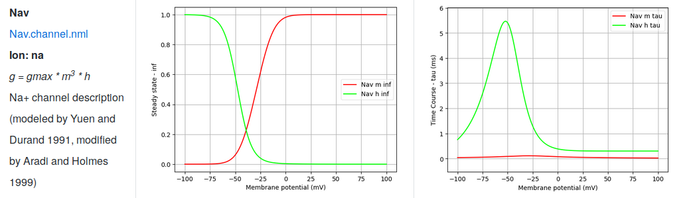
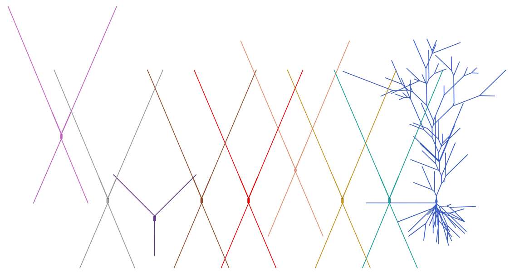

## NeuroML 2 version of the CA1 network model

The CA1 network was originally developed in [NEURON](https://www.neuron.yale.edu/neuron/) 
and all the (necessary) model files have been converted to [NeuroML](https://www.neuroml.org/neuromlv2). 
In this version, the model transparency has improved in order to facilitate greater reusability. 
The NeuroML version allows testing in a standardized, continuous way using [OMV](https://github.com/OpenSourceBrain/osb-model-validation).

#### Using the NeuroML 2 models
**Installation**

Install [jNeuroML](https://github.com/NeuroML/jNeuroML). *Installation from source is recommended, using the latest development version, i.e.:*

    git clone git://github.com/NeuroML/jNeuroML.git neuroml_dev/jNeuroML
    cd neuroml_dev/jNeuroML
    python getNeuroML.py development
    
For this you will need some Java development tools installed (see [here](https://github.com/NeuroML/jNeuroML)). Ensure the `jnml` executable is present on your PATH.

Clone this repository, and checkout the development branch:

    git clone https://github.com/mbezaire/ca1.git
    cd ca1
    git checkout development

**Ion channels**

To see the converted channel files, and the comparison to the original ones, 
click [here](https://github.com/mbezaire/ca1/tree/development/NeuroML2/channels).

<table border="1"><tr><td></td></tr></table>

**Cell models**

The cell models are available in NeuroML2 format [here](cells). 

<table border="1"><tr><td></td></tr></table>
Cells included in model. From left: neurogliaform, ivy, OLM, bistratified, axoaxonic cell, S.C. associated (sca), CCK, PV+ basket, pyramidal.

Properties of individual cells are illustrated in Jupyter notebooks. To run the notebooks and learn more about the cell models install [pyNeuroML](https://github.com/NeuroML/pyNeuroML) and run:

    cd ca1/NeuroML2/notebooks
    jupyter notebook

See all of the available notebooks [here](https://github.com/mbezaire/ca1/tree/development/NeuroML2/notebooks).
  
**Networks**

To be able to rebuild the networks install [OpenCortex](https://github.com/OpenSourceBrain/OpenCortex) and run:

    cd ca1/NeuroML2/network
    python GenerateHippocampalNet_oc.py 100000  # builds a scaled down (to 100000) network
    
or just skip this step and use the provided example (also scaled down to 100000) and run:

    jnml LEMS_HippocampalNetwork_scale100000_oc.xml -neuron -run  # run with NERUON (you will need NEURON installed) 
    
Want to run the simulations in parallel? NetPyNE is a NeuroML friendly NEURON parallelization package which does the work under the hood.
You just have to install [NetPyNE](https://github.com/Neurosim-lab/netpyne) and run:

    jnml LEMS_HippocampalNetwork_scale100000_oc.xml -netpyne -np -4  # will run on 4 cores

See more [here](https://github.com/mbezaire/ca1/tree/master/NeuroML2/network)

The **CA1 network model** was converted to NeuroML2 as part of a [Google Summer of Code 2017](https://developers.google.com/open-source/gsoc/) 
project through the [INCF](https://www.incf.org/) by András Ecker with Padraig Gleeson as mentor. 

For further support please contact: ecker.andris@gmail.com, or just open an issue!

