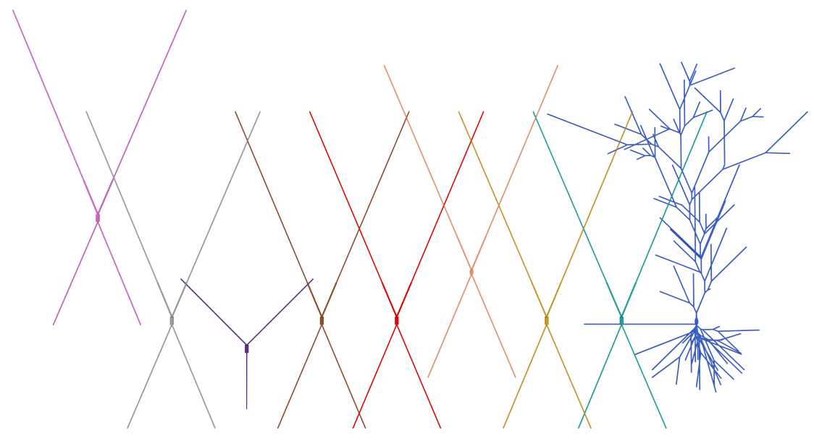

### NeuroML2 cells

This directory host the NeuroML2 cell models and tests linked to [OMV](https://github.com/OpenSourceBrain/osb-model-validation). 

To see more about the properties of individual cell models, go to the [notebooks folder](../notebooks).

To visualize cell morphologies alongside each other install [POV-Ray](http://www.povray.org/) 
as well as [pyNeuroML](https://github.com/NeuroML/pyNeuroML) and run:

    pynml-povray visualize_cells.net.nml -scalez 350 -mindiam 1.5
    povray Antialias=On Antialias_Depth=10 Antialias_Threshold=0.1 +W1200 +H900 visualize_cells.net.nml.pov

<table border="1"><tr><td></td></tr></table>
Cells included in model. From left: neurogliaform, ivy, OLM, bistratified, axoaxonic cell, S.C. associated (sca), CCK, PV+ basket, pyramidal.

