Channel information
===================
    

Channel information at: T = 24.0 degC, E_rev = 0 mV, [Ca2+] = 5e-06 mM

<table>
    <tr>
<td width="120px">
            <b>Nav</b> 
            <a href="../Nav.channel.nml">Nav.channel.nml</a> 
            <b>Ion: na</b> 
            <i>g = gmax * m3 * h </i> 
            Na+ channel description (modeled by Marianne Bezaire)
</td>
<td>
<a href="Nav.inf.png">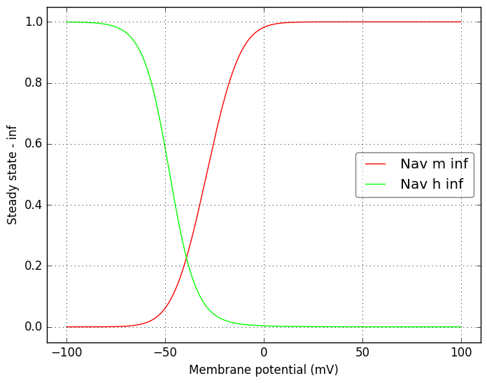</a>
</td>
<td>
<a href="Nav.tau.png">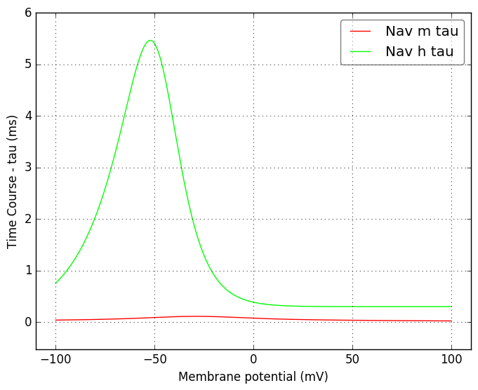</a>
</td>
</tr>
    <tr>
<td width="120px">
            <b>Navbis</b> 
            <a href="../Navbis.channel.nml">Navbis.channel.nml</a> 
            <b>Ion: na</b> 
            <i>g = gmax * m3 * h </i> 
            Na+ channel description (modeled by Marianne Bezaire).
        Modified from Nav to have a slightly higher threshold, suitable for bistratified cells
</td>
<td>

</td>
<td>
<a href="Navbis.tau.png">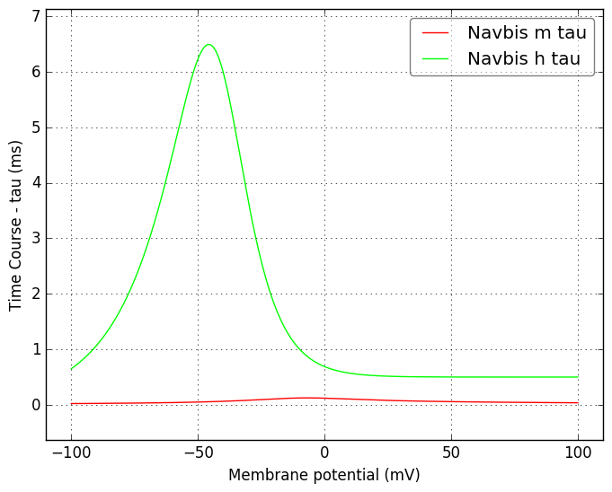</a>
</td>
</tr>
    <tr>
<td width="120px">
            <b>Navcck</b> 
            <a href="../Navcck.channel.nml">Navcck.channel.nml</a> 
            <b>Ion: na</b> 
            <i>g = gmax * m3 * h </i> 
            Na+ channel description (modeled by Marianne Bezaire)
</td>
<td>
<a href="Navcck.inf.png">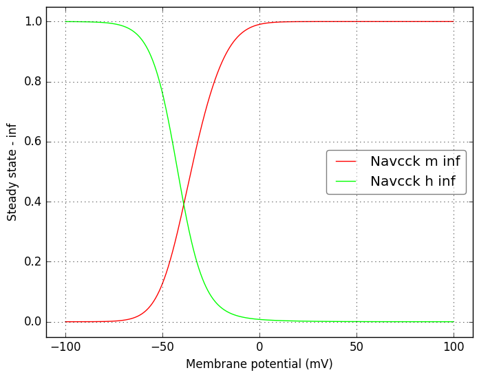</a>
</td>
<td>
<a href="Navcck.tau.png">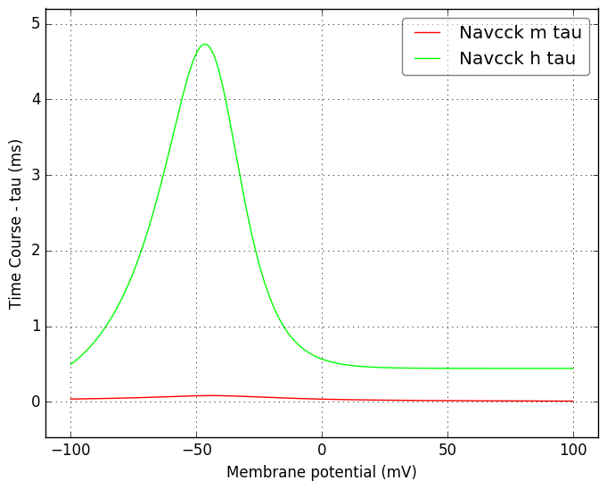</a>
</td>
</tr>
    <tr>
<td width="120px">
            <b>Navaxonp</b> 
            <a href="../Navaxonp.channel.nml">Navaxonp.channel.nml</a> 
            <b>Ion: na</b> 
            <i>g = gmax * m3 * h </i> 
            Na+ channel description for axon (from Migliore 1997, modified in 2002).
        Navp without the slow inactivation (s - gating variable)
</td>
<td>
<a href="Navaxonp.inf.png">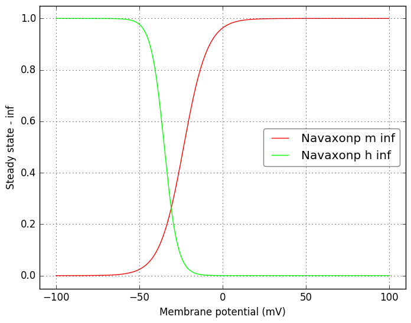</a>
</td>
<td>
<a href="Navaxonp.tau.png">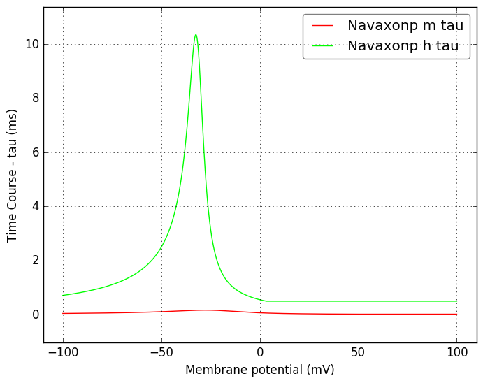</a>
</td>
</tr>
    <tr>
<td width="120px">
            <b>Navngf</b> 
            <a href="../Navngf.channel.nml">Navngf.channel.nml</a> 
            <b>Ion: na</b> 
            <i>g = gmax * m3 * h </i> 
            Na+ channel description for neurogliaform family (modeled by Marianne Bezaire)
</td>
<td>
<a href="Navngf.inf.png">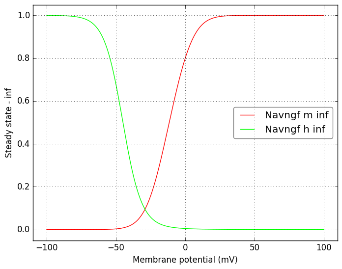</a>
</td>
<td>
<a href="Navngf.tau.png">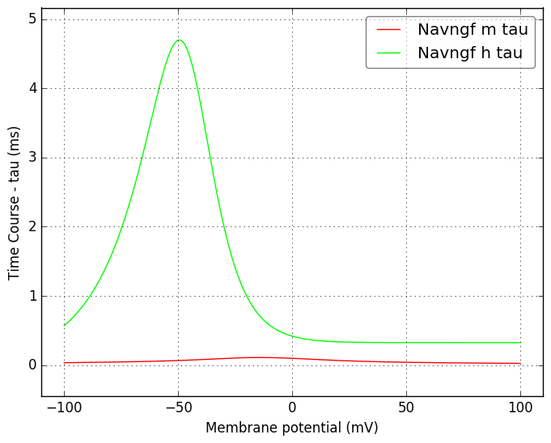</a>
</td>
</tr>
    <tr>
<td width="120px">
            <b>Navp</b> 
            <a href="../Navp.channel.nml">Navp.channel.nml</a> 
            <b>Ion: na</b> 
            <i>g = gmax * m3 * h * s </i> 
            Na+ channel description (from Migliore 1997, modified in 2002)
</td>
<td>
<a href="Navp.inf.png">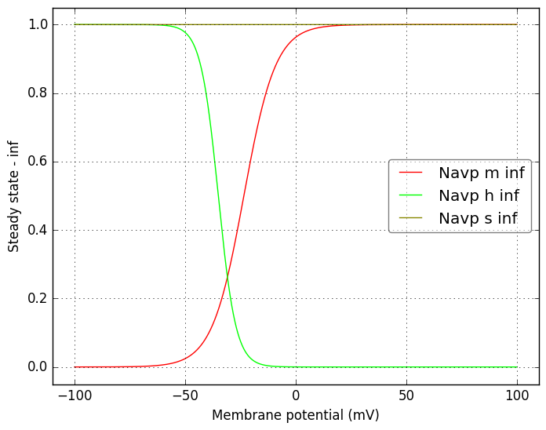</a>
</td>
<td>
<a href="Navp.tau.png">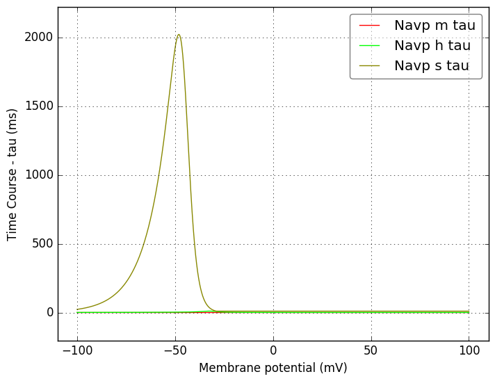</a>
</td>
</tr>
    <tr>
<td width="120px">
            <b>Navapicalp</b> 
            <a href="../Navp.channel.nml">Navp.channel.nml</a> 
            <b>Ion: na</b> 
            <i>g = gmax * m3 * h * s </i> 
            ${channel.notes}
</td>
<td>

</td>
<td>
<a href="Navapicalp.tau.png">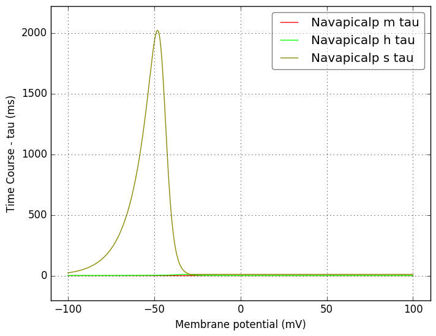</a>
</td>
</tr>
    <tr>
<td width="120px">
            <b>Kdrslow</b> 
            <a href="../Kdrslow.channel.nml">Kdrslow.channel.nml</a> 
            <b>Ion: k</b> 
            <i>g = gmax * n4 </i> 
            Slow delayed rectifier K+ channel description (from Storm 1990, modeled by Marianne Bezaire)
</td>
<td>
<a href="Kdrslow.inf.png">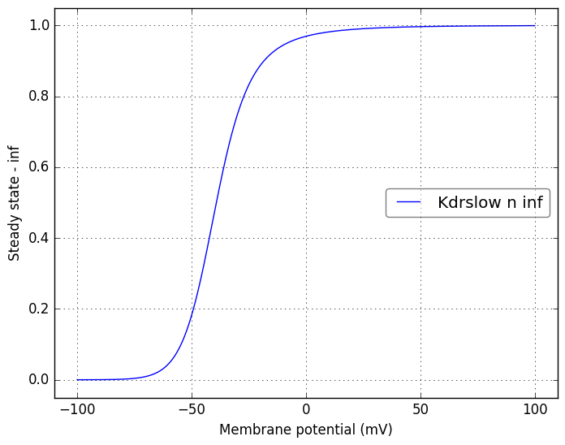</a>
</td>
<td>
<a href="Kdrslow.tau.png">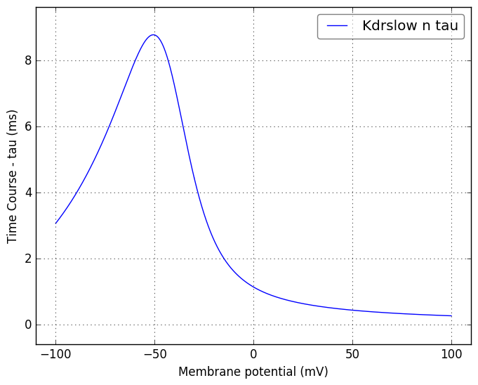</a>
</td>
</tr>
    <tr>
<td width="120px">
            <b>Kdrfast</b> 
            <a href="../Kdrfast.channel.nml">Kdrfast.channel.nml</a> 
            <b>Ion: k</b> 
            <i>g = gmax * n4 </i> 
            Fast delayed rectifier K+ channel description (from Yuen and Durand 1991, modeled by Marianne Bezaire)
</td>
<td>
<a href="Kdrfast.inf.png">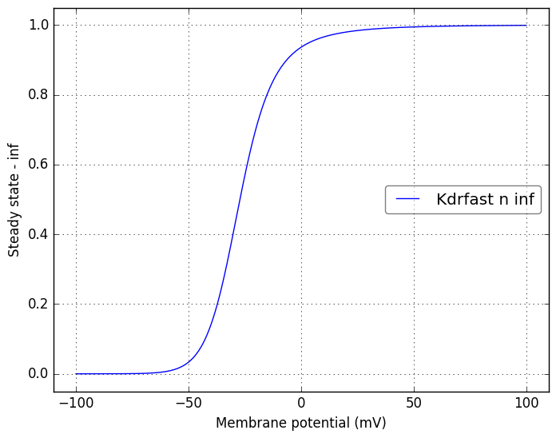</a>
</td>
<td>
<a href="Kdrfast.tau.png">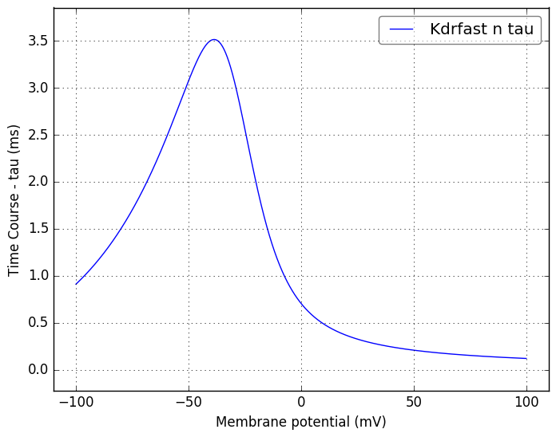</a>
</td>
</tr>
    <tr>
<td width="120px">
            <b>Kdrp</b> 
            <a href="../Kdrp.channel.nml">Kdrp.channel.nml</a> 
            <b>Ion: k</b> 
            <i>g = gmax * n </i> 
            Delayed rectifier K+ channel description (from Migliore 1997 - modified by Marianne Bezaire)
</td>
<td>
<a href="Kdrp.inf.png">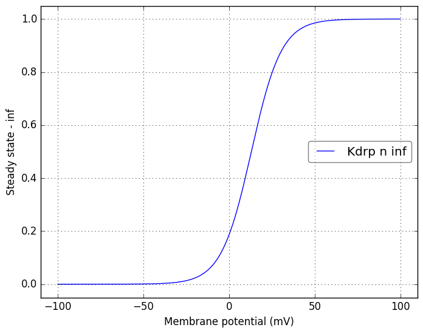</a>
</td>
<td>
<a href="Kdrp.tau.png">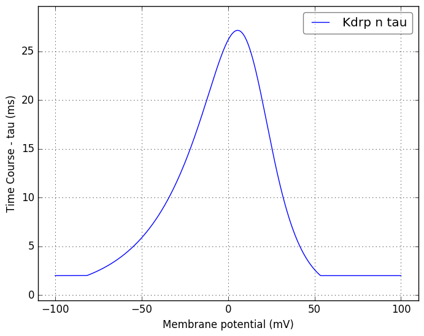</a>
</td>
</tr>
    <tr>
<td width="120px">
            <b>Kdrfastngf</b> 
            <a href="../Kdrfastngf.channel.nml">Kdrfastngf.channel.nml</a> 
            <b>Ion: k</b> 
            <i>g = gmax * n4 </i> 
            Fast delayed rectifier K+ channel description for neurogliaform family (from Yuen and Durand 1991, modeled by Marianne Bezaire)
</td>
<td>
<a href="Kdrfastngf.inf.png">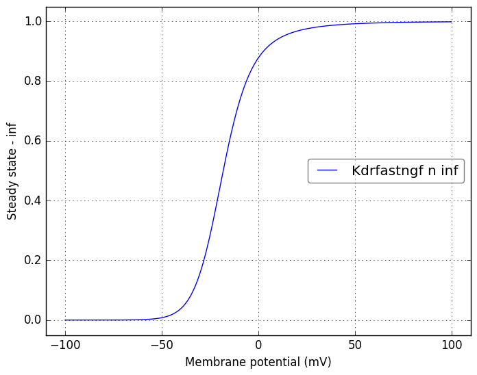</a>
</td>
<td>
<a href="Kdrfastngf.tau.png">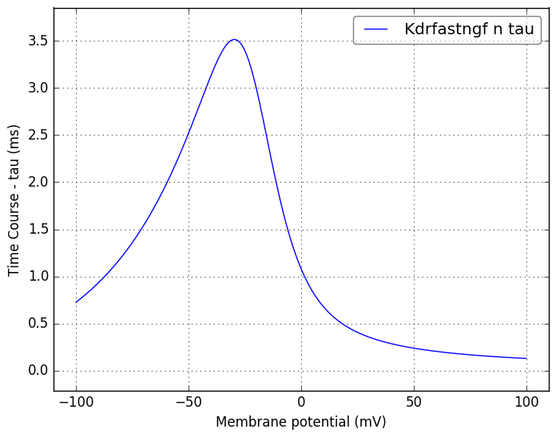</a>
</td>
</tr>
    <tr>
<td width="120px">
            <b>KvAolm</b> 
            <a href="../KvAolm.channel.nml">KvAolm.channel.nml</a> 
            <b>Ion: k</b> 
            <i>g = gmax * a * b </i> 
            A-type K+ channel description (from Zhang and McBain 1995, Martina 1998, Warman 1994 - modeled by Marianne Bezaire)
</td>
<td>
<a href="KvAolm.inf.png">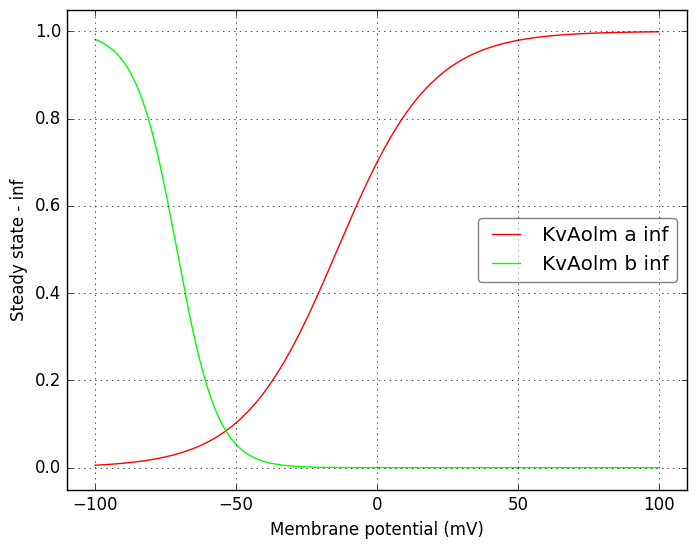</a>
</td>
<td>
<a href="KvAolm.tau.png">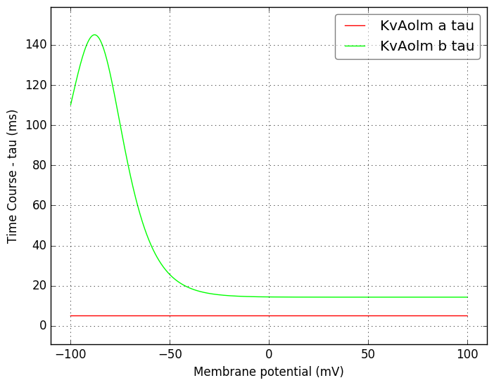</a>
</td>
</tr>
    <tr>
<td width="120px">
            <b>KvA</b> 
            <a href="../KvA.channel.nml">KvA.channel.nml</a> 
            <b>Ion: k</b> 
            <i>g = gmax * n * l </i> 
            A-type K+ channel description (from Migliore 1995 - modified by Marianne Bezaire)
</td>
<td>
<a href="KvA.inf.png">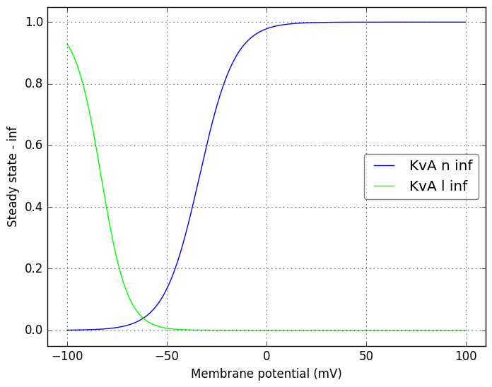</a>
</td>
<td>
<a href="KvA.tau.png">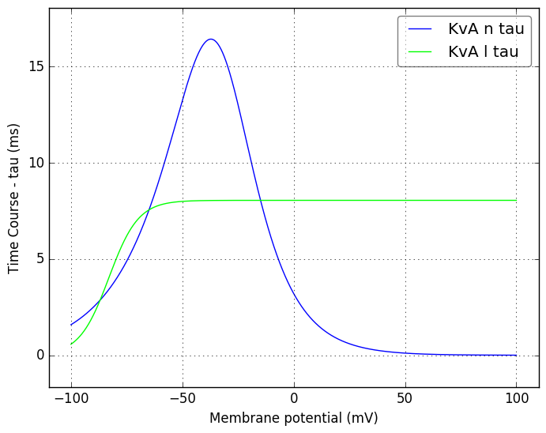</a>
</td>
</tr>
    <tr>
<td width="120px">
            <b>KvAproxp</b> 
            <a href="../KvAproxp.channel.nml">KvAproxp.channel.nml</a> 
            <b>Ion: k</b> 
            <i>g = gmax * n * l </i> 
            A-type K+ channel description (from Klee, Ficker and Heinmann 1995, modeled by Migliore 1997, 2001 - modified by Poirazi 2003)
</td>
<td>
<a href="KvAproxp.inf.png">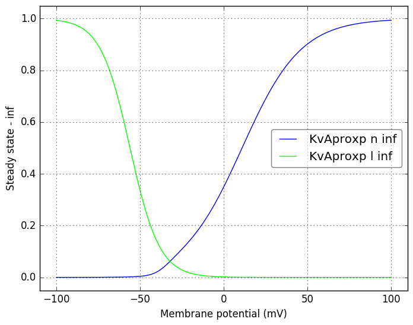</a>
</td>
<td>
<a href="KvAproxp.tau.png">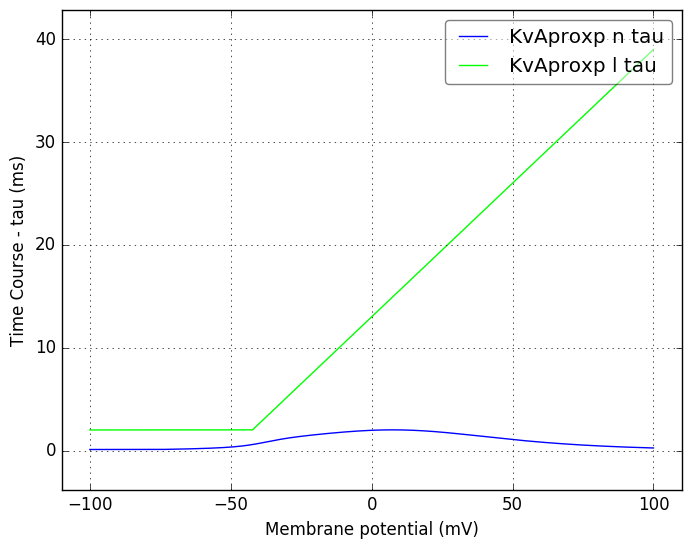</a>
</td>
</tr>
    <tr>
<td width="120px">
            <b>KvAdistp</b> 
            <a href="../KvAdistp.channel.nml">KvAdistp.channel.nml</a> 
            <b>Ion: k</b> 
            <i>g = gmax * n * l </i> 
            A-type K+ channel description (from Klee, Ficker and Heinmann 1995, modeled by Migliore 1997 - modified by Poirazi 2003, Marianne Bezaire)
</td>
<td>
<a href="KvAdistp.inf.png">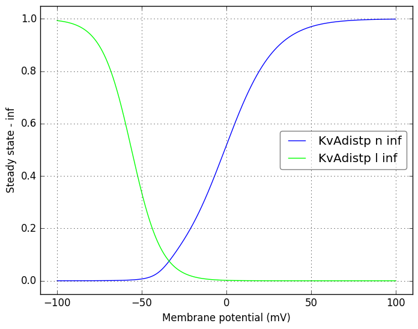</a>
</td>
<td>

</td>
</tr>
    <tr>
<td width="120px">
            <b>KvAngf</b> 
            <a href="../KvAngf.channel.nml">KvAngf.channel.nml</a> 
            <b>Ion: k</b> 
            <i>g = gmax * n * l </i> 
            A-type K+ channel description for neurogliaform family (unknown - modeled by Marianne Bezaire)
</td>
<td>
<a href="KvAngf.inf.png">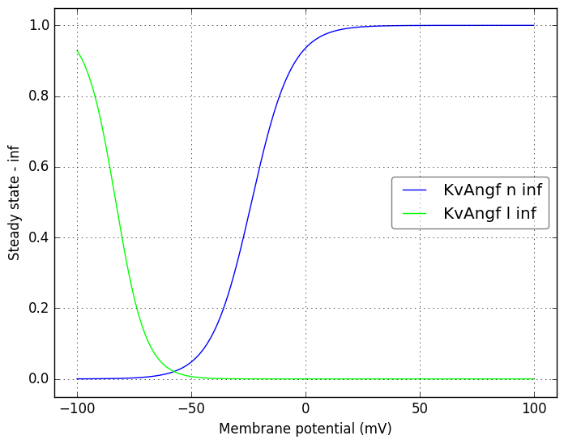</a>
</td>
<td>
<a href="KvAngf.tau.png">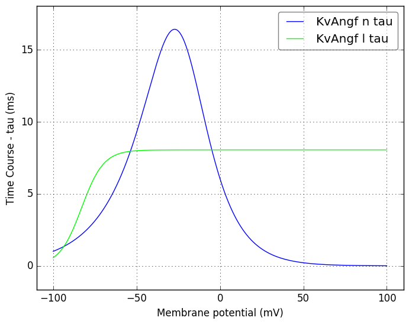</a>
</td>
</tr>
    <tr>
<td width="120px">
            <b>KvGroup</b> 
            <a href="../KvGroup.channel.nml">KvGroup.channel.nml</a> 
            <b>Ion: k</b> 
            <i>g = gmax * n </i> 
            Slow K+ channel description (from Yuen and Durand 1991 - modeled by Aradi and Holmes 2002)
</td>
<td>

</td>
<td>
<a href="KvGroup.tau.png">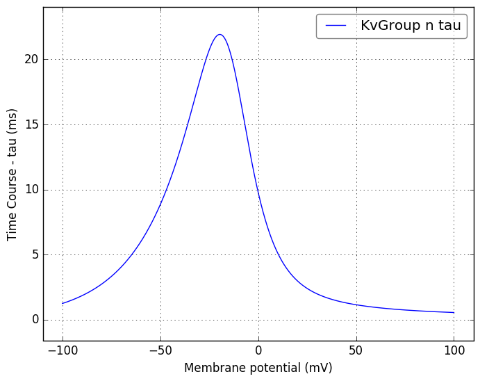</a>
</td>
</tr>
    <tr>
<td width="120px">
            <b>KvCaB</b> 
            <a href="../KvCaB.channel.nml">KvCaB.channel.nml</a> 
            <b>Ion: k</b> 
            <i>g = gmax * o </i> 
            Ca++ activated mAHP K+ channel description (from Moczydlowski and Latorre 1983 - modeled by Poirazi 2003, Lawrence 2006 (same parameters))
</td>
<td>
<a href="KvCaB.inf.png">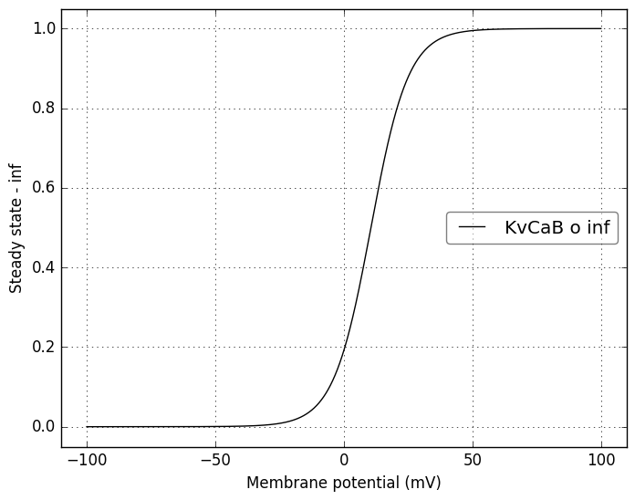</a>
</td>
<td>
<a href="KvCaB.tau.png">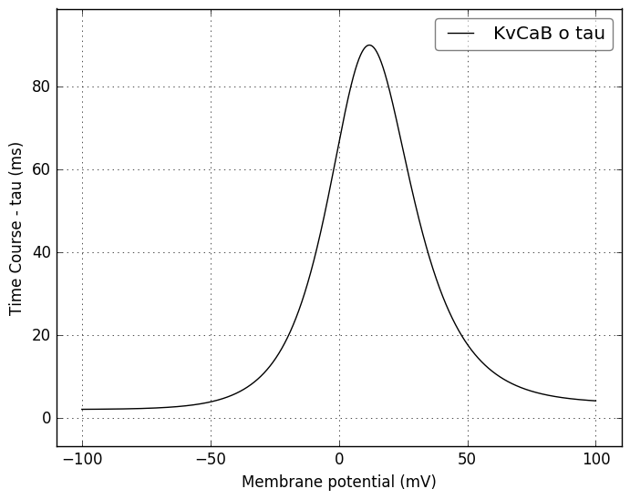</a>
</td>
</tr>
    <tr>
<td width="120px">
            <b>CavN</b> 
            <a href="../CavN.channel.nml">CavN.channel.nml</a> 
            <b>Ion: ca</b> 
            <i>g = gmax * c2 * d </i> 
            N-type Ca++ channel description (from Aradi and Holmes 1999)
</td>
<td>
<a href="CavN.inf.png">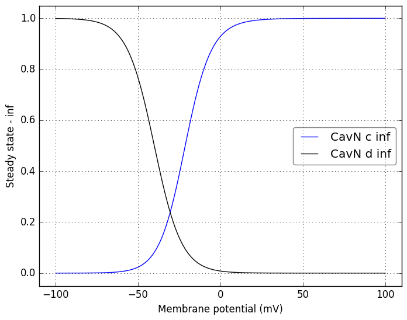</a>
</td>
<td>
<a href="CavN.tau.png">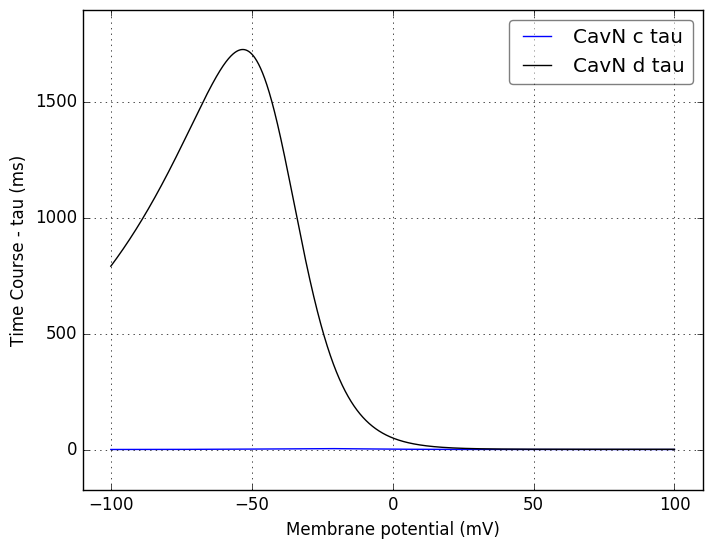</a>
</td>
</tr>
    <tr>
<td width="120px">
            <b>HCNolm</b> 
            <a href="../HCNolm.channel.nml">HCNolm.channel.nml</a> 
            <b>Ion: h</b> 
            <i>g = gmax * r </i> 
            Hyperpolarization-activated, CN-gated h channel description (from Lawrence 2006)
</td>
<td>
<a href="HCNolm.inf.png">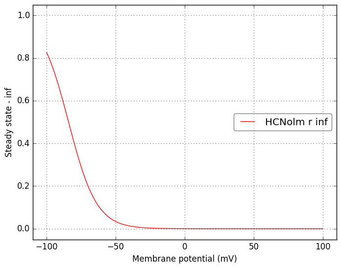</a>
</td>
<td>
<a href="HCNolm.tau.png">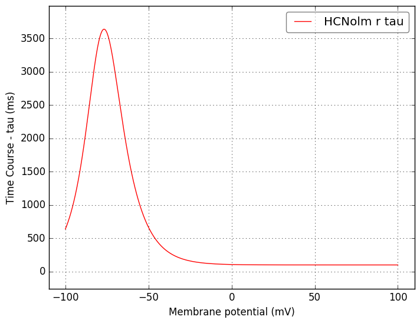</a>
</td>
</tr>
    <tr>
<td width="120px">
            <b>HCN</b> 
            <a href="../HCN.channel.nml">HCN.channel.nml</a> 
            <b>Ion: non_specific</b> 
            <i>g = gmax * h2 </i> 
            Hyperpolarization-activated, CN-gated channel description (from Chen 2001 - modeled by Ildiko Aradi)
</td>
<td>
<a href="HCN.inf.png">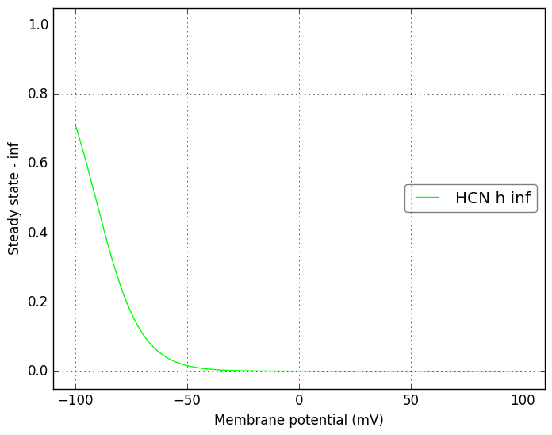</a>
</td>
<td>
<a href="HCN.tau.png">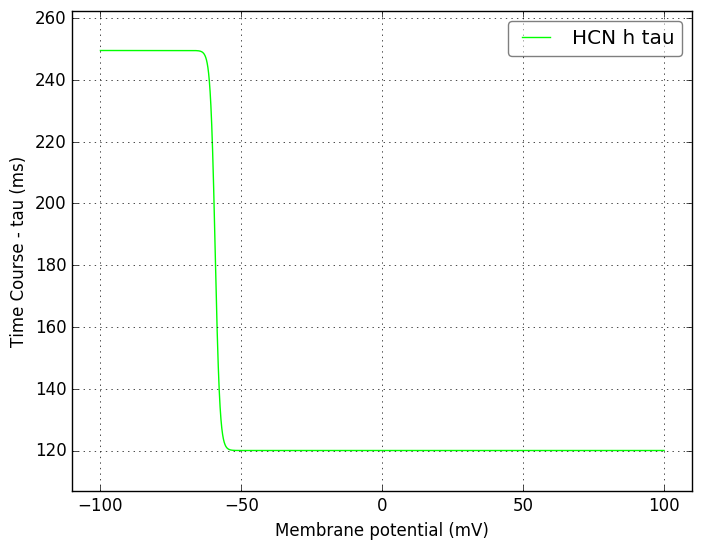</a>
</td>
</tr>
    <tr>
<td width="120px">
            <b>HCNp</b> 
            <a href="../HCNp.channel.nml">HCNp.channel.nml</a> 
            <b>Ion: non_specific</b> 
            <i>g = gmax * l </i> 
            Hyperpolarization-activated, CN-gated channel descriptions (from Magee 1998 - modeled by Marianne Bezaire)
</td>
<td>

</td>
<td>
<a href="HCNp.tau.png">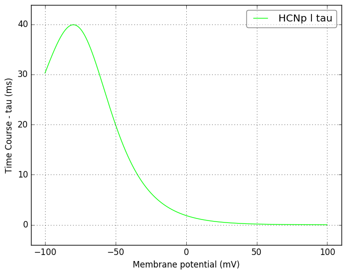</a>
</td>
</tr>
    <tr>
<td width="120px">
            <b>HCNsomap</b> 
            <a href="../HCNp.channel.nml">HCNp.channel.nml</a> 
            <b>Ion: non_specific</b> 
            <i>g = gmax * l </i> 
            ${channel.notes}
</td>
<td>
<a href="HCNsomap.inf.png">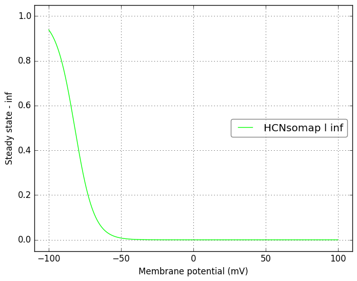</a>
</td>
<td>
<a href="HCNsomap.tau.png">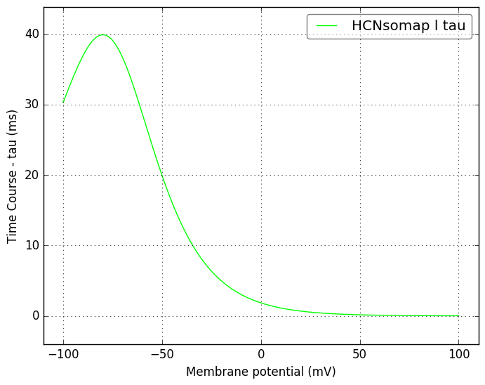</a>
</td>
</tr>
</table>

