#### Kdrfast

<a href="../../../ch_Kdrfast.mod">ch_Kdrfast.mod</a>, <a href="../Kdrfast.channel.nml">Kdrfast.channel.nml</a>

<table><tr>
<td></td>
<td></td>
</tr></table>

#### Kdrslow

<a href="../../../ch_Kdrslow.mod">ch_Kdrslow.mod</a>, <a href="../Kdrslow.channel.nml">Kdrslow.channel.nml</a>

<table><tr>
<td></td>
<td></td>
</tr></table>

#### Kdrp

<a href="../../../ch_Kdrp.mod">ch_Kdrp.mod</a>, <a href="../Kdrp.channel.nml">Kdrp.channel.nml</a>

<table><tr>
<td></td>
<td></td>
</tr></table>

#### Kdrfastngf

<a href="../../../ch_Kdrfastngf.mod">ch_Kdrfastngf.mod</a>, <a href="../Kdrfastngf.channel.nml">Kdrfastngf.channel.nml</a>

<table><tr>
<td></td>
<td></td>
</tr></table>

#### KvA

<a href="../../../ch_KvA.mod">ch_KvA.mod</a>, <a href="../KvA.channel.nml">KvA.channel.nml</a>

<table><tr>
<td></td>
<td></td>
<td></td>
<td></td>
</tr></table>

#### KvAolm

<a href="../../../ch_KvAolm.mod">ch_KvAolm.mod</a>, <a href="../KvAolm.channel.nml">KvAolm.channel.nml</a>

<table><tr>
<td></td>
<td></td>
<td></td>
<td><a href="KvAolm_b_inf.png">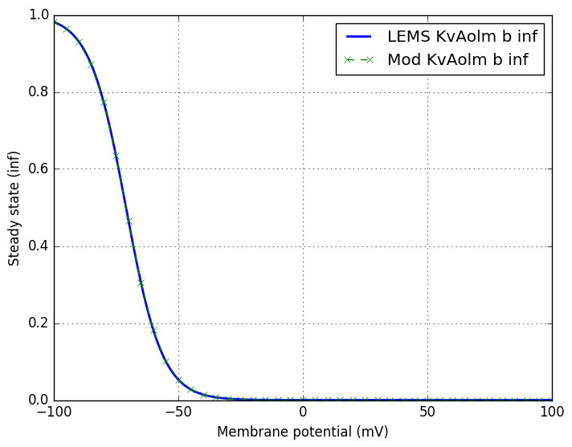</a></td>
</tr></table>

#### KvAproxp

<a href="../../../ch_KvAproxp.mod">ch_KvAproxp.mod</a>, <a href="../KvAproxp.channel.nml">KvAproxp.channel.nml</a>

<table><tr>
<td></td>
<td></td>
<td></td>
<td></td>
</tr></table>

#### KvAdistp

<a href="../../../ch_KvAdistp.mod">ch_KvAdistp.mod</a>, <a href="../KvAdistp.channel.nml">KvAdistp.channel.nml</a>

<table><tr>
<td></td>
<td></td>
<td></td>
<td><a href="KvAdistp_l_inf.png">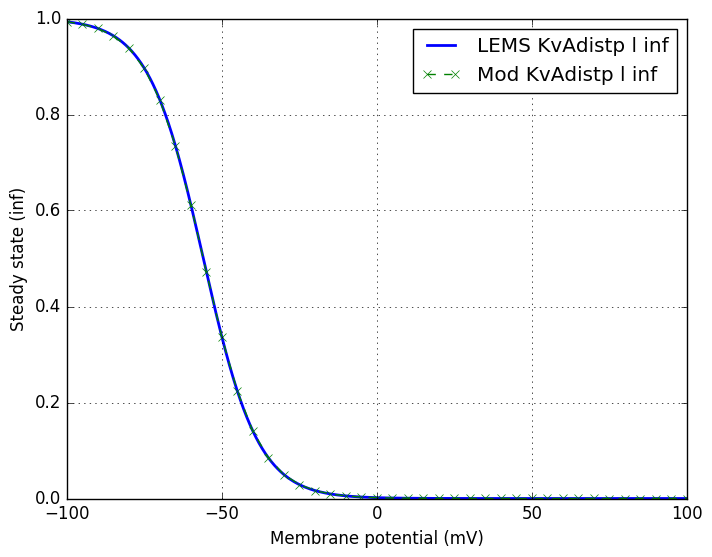</a></td>
</tr></table>

#### KvAngf

<a href="../../../ch_KvAngf.mod">ch_KvAngf.mod</a>, <a href="../KvAngf.channel.nml">KvAngf.channel.nml</a>

<table><tr>
<td></td>
<td><a href="KvAngf_l_tau.png">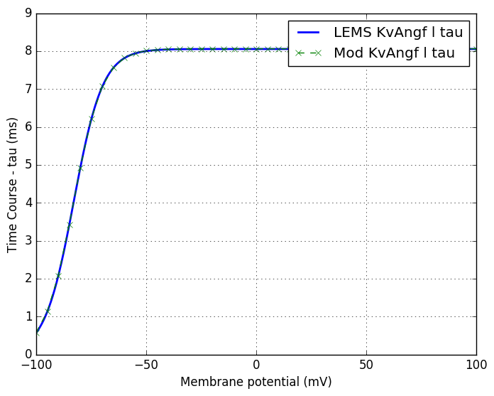</a></td>
<td></td>
<td></td>
</tr></table>

#### KvGroup

<a href="../../../ch_KvGroup.mod">ch_KvGroup.mod</a>, <a href="../KvGroup.channel.nml">KvGroup.channel.nml</a>

<table><tr>
<td></td>
<td></td>
</tr></table>

#### KvCaB

<a href="../../../ch_KvCaB.mod">ch_KvCaB.mod</a>, <a href="../KvCaB.channel.nml">KvCaB.channel.nml</a>

<table><tr>
<td></td>
<td></td>
</tr></table>

#### HCN

<a href="../../../ch_HCN.mod">ch_HCN.mod</a>, <a href="../HCN.channel.nml">HCN.channel.nml</a>

<table><tr>
<td></td>
<td></td>
</tr></table>

#### HCNolm

<a href="../../../ch_HCNolm.mod">ch_HCNolm.mod</a>, <a href="../HCNolm.channel.nml">HCNolm.channel.nml</a>

<table><tr>
<td></td>
<td></td>
</tr></table>

#### HCNp

<a href="../../../ch_HCNp.mod">ch_HCNp.mod</a>, <a href="../HCNp.channel.nml">HCNp.channel.nml</a>

<table><tr>
<td></td>
<td></td>
</tr></table>

#### Nav

<a href="../../../ch_Nav.mod">ch_Nav.mod</a>, <a href="../Nav.channel.nml">Nav.channel.nml</a>

<table><tr>
<td></td>
<td></td>
<td></td>
<td><a href="Nav_h_inf.png">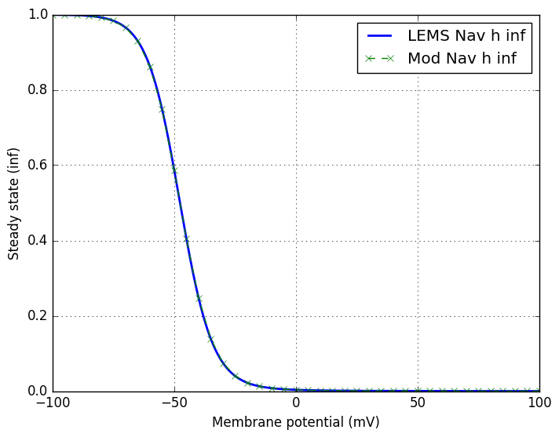</a></td>
</tr></table>

#### Navbis

<a href="../../../ch_Navbis.mod">ch_Navbis.mod</a>, <a href="../Navbis.channel.nml">Navbis.channel.nml</a>

<table><tr>
<td></td>
<td></td>
<td></td>
<td></td>
</tr></table>

#### Navcck

<a href="../../../ch_Navcck.mod">ch_Navcck.mod</a>, <a href="../Navcck.channel.nml">Navcck.channel.nml</a>

<table><tr>
<td></td>
<td></td>
<td><a href="Navcck_m_inf.png">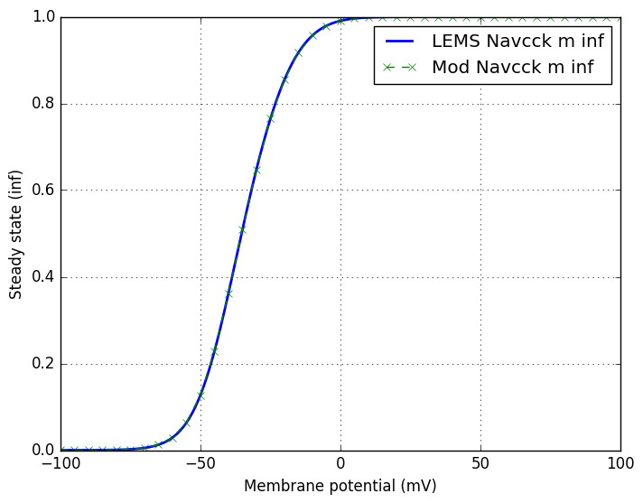</a></td>
<td></td>
</tr></table>

#### Navaxonp

<a href="../../../ch_Navaxonp.mod">ch_Navaxonp.mod</a>, <a href="../Navaxonp.channel.nml">Navaxonp.channel.nml</a>

<table><tr>
<td></td>
<td></td>
<td></td>
<td><a href="Navaxonp_h_inf.png">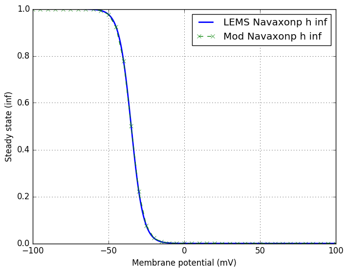</a></td>
</tr></table>

#### Navp

<a href="../../../ch_Navp.mod">ch_Navp.mod</a>, <a href="../Navp.channel.nml">Navp.channel.nml</a>

<table><tr>
<td></td>
<td></td>
<td><a href="Navp_s_tau.png">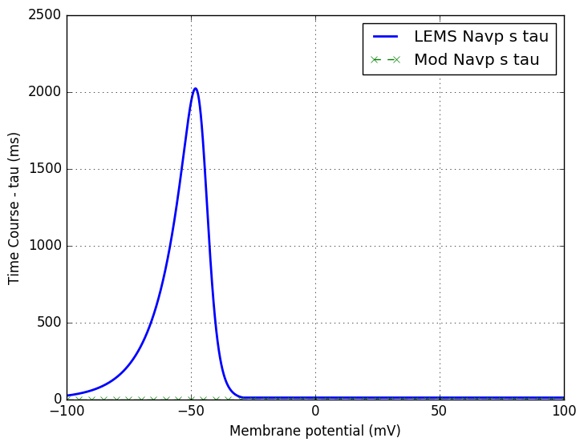</a></td>
<td></td>
<td></td>
<td></td>
</tr></table>

#### Navapicalp

<a href="../../../ch_Navapicalp.mod">ch_Navapicalp.mod</a>, <a href="../Navapicalp.channel.nml">Navapicalp.channel.nml</a>

<table><tr>
<td></td>
<td></td>
<td></td>
<td></td>
<td></td>
<td></td>
</tr></table>

#### Navngf

<a href="../../../ch_Navngf.mod">ch_Navngf.mod</a>, <a href="../Navngf.channel.nml">Navngf.channel.nml</a>

<table><tr>
<td><a href="Navngf_m_tau.png">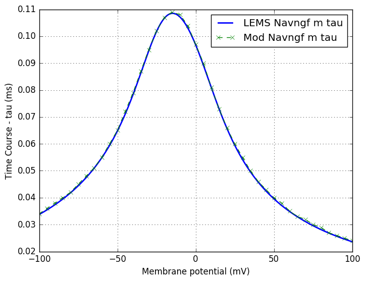</a></td>
<td></td>
<td><a href="Navngf_m_inf.png">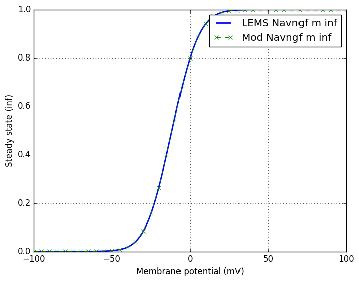</a></td>
<td></td>
</tr></table>

#### CavL

<a href="../../../ch_CavL.mod">ch_CavL.mod</a>, <a href="../CavL.channel.nml">CavL.channel.nml</a>

<table><tr>
<td></td>
<td></td>
</tr></table>

#### CavN

<a href="../../../ch_CavN.mod">ch_CavN.mod</a>, <a href="../CavN.channel.nml">CavN.channel.nml</a>

<table><tr>
<td></td>
<td><a href="CavN_d_tau.png">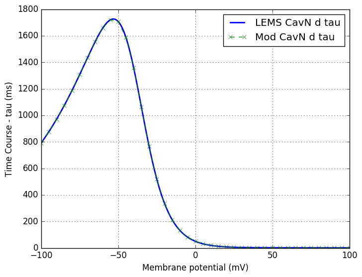</a></td>
<td></td>
<td><a href="CavN_d_inf.png">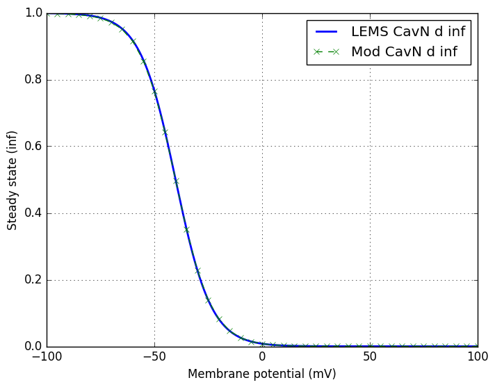</a></td>
</tr></table>
