### CA1 cell summary 
<table>
<tr>
  <td><b>sca</b></td>
  <td><a href="mean_spike_frequency_sca.png">
    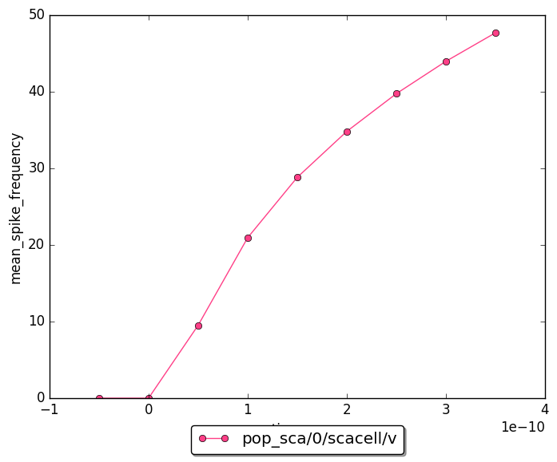</a>
  </td>
  <td><a href="firing_rates_sca.png">
    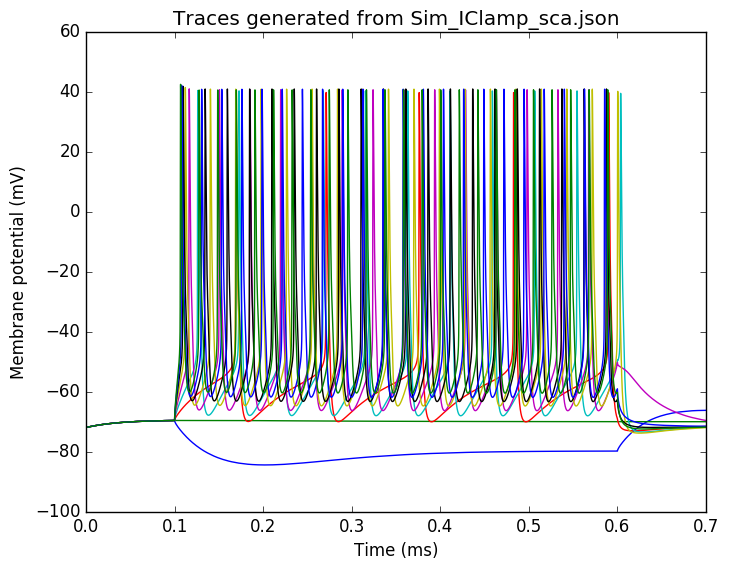</a>
  </td>
  <td>
  </td>
<tr>
<tr>
  <td><b>olm</b></td>
  <td><a href="mean_spike_frequency_olm.png">
    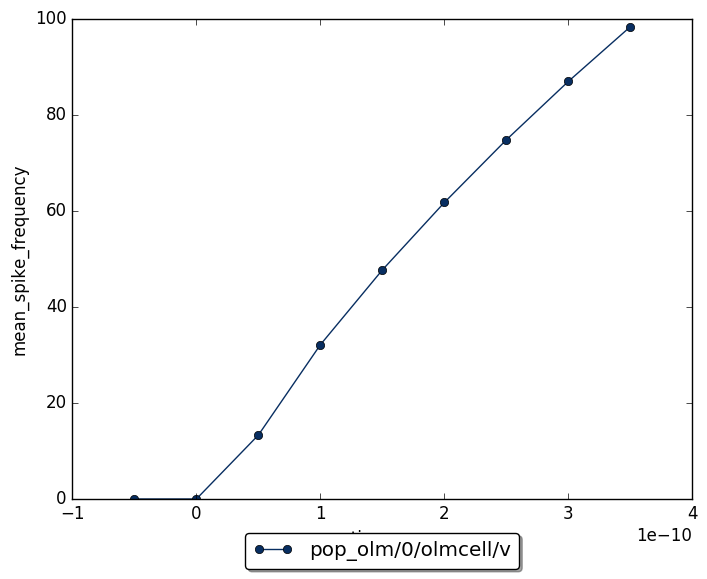</a>
  </td>
  <td><a href="firing_rates_olm.png">
    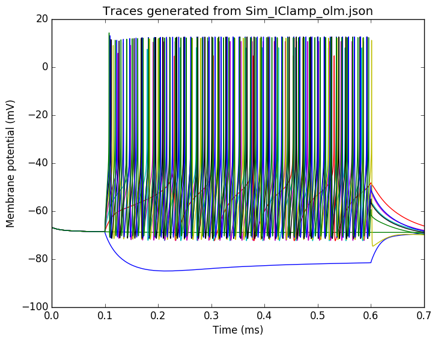</a>
  </td>
  <td><a href="heatmap_olm.png">
    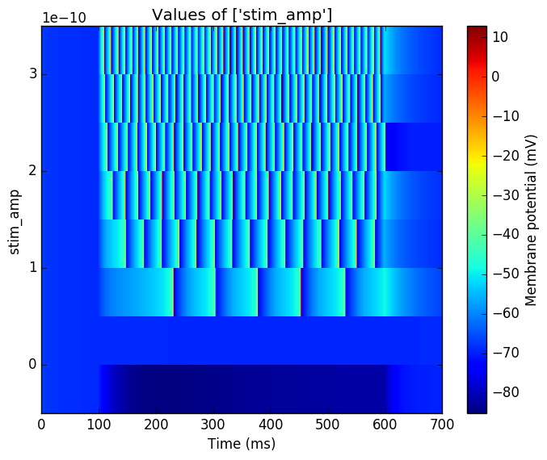</a>
  </td>
<tr>
<tr>
  <td><b>pvbasket</b></td>
  <td><a href="mean_spike_frequency_pvbasket.png">
    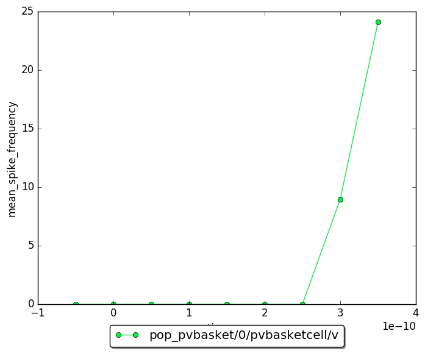</a>
  </td>
  <td><a href="firing_rates_pvbasket.png">
    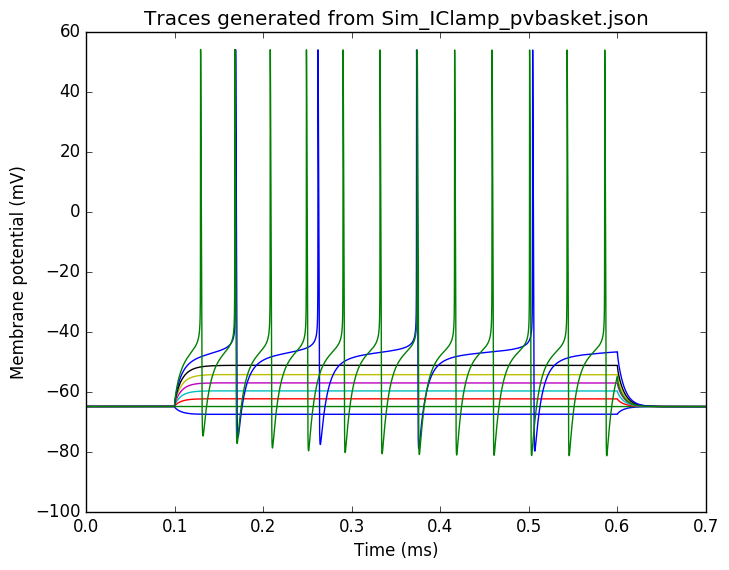</a>
  </td>
  <td><a href="heatmap_pvbasket.png">
    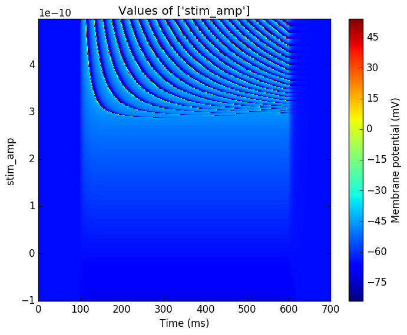</a>
  </td>
<tr>
<tr>
  <td><b>ivy</b></td>
  <td><a href="mean_spike_frequency_ivy.png">
    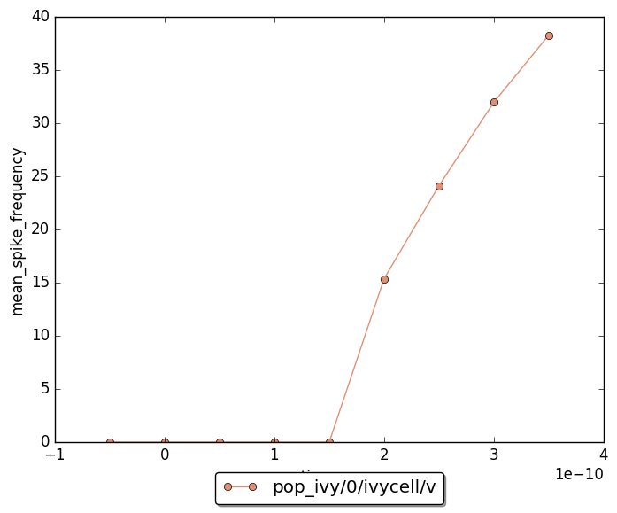</a>
  </td>
  <td><a href="firing_rates_ivy.png">
    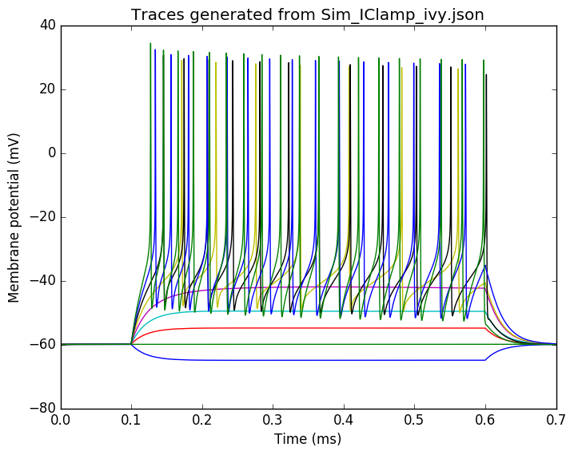</a>
  </td>
  <td><a href="heatmap_ivy.png">
    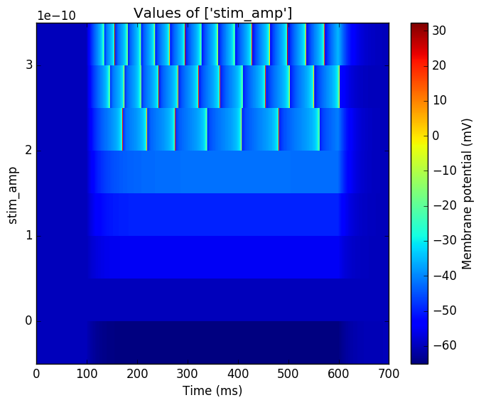</a>
  </td>
<tr>
<tr>
  <td><b>ngf</b></td>
  <td><a href="mean_spike_frequency_ngf.png">
    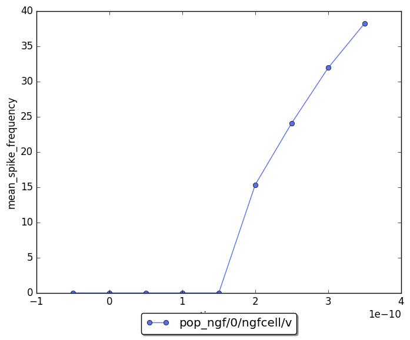</a>
  </td>
  <td><a href="firing_rates_ngf.png">
    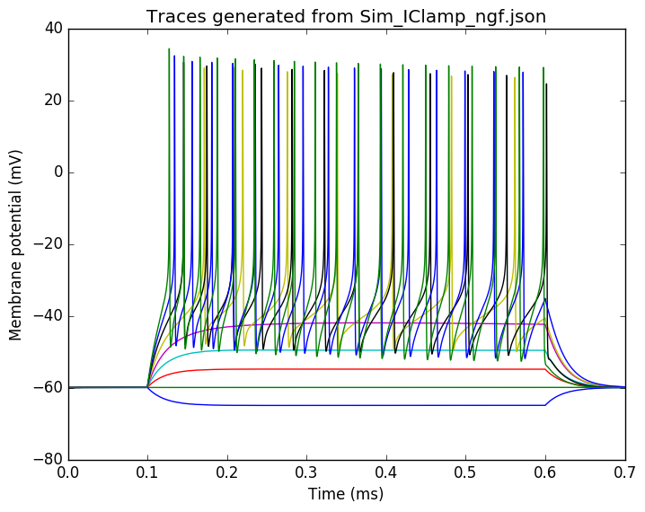</a>
  </td>
  <td>
  </td>
<tr>
<tr>
  <td><b>bistratified</b></td>
  <td><a href="mean_spike_frequency_bistratified.png">
    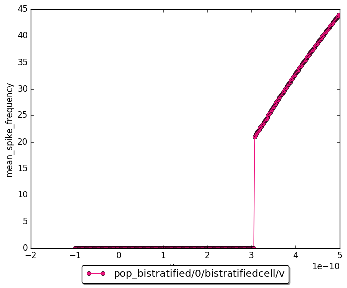</a>
  </td>
  <td><a href="firing_rates_bistratified.png">
    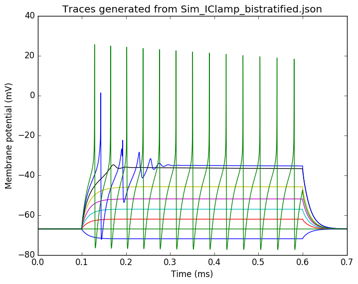</a>
  </td>
  <td><a href="heatmap_bistratified.png">
    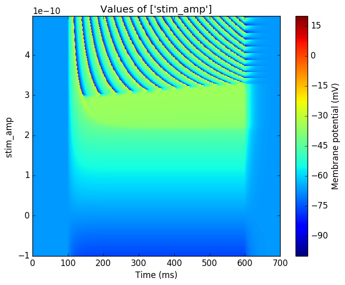</a>
  </td>
<tr>
<tr>
  <td><b>cck</b></td>
  <td><a href="mean_spike_frequency_cck.png">
    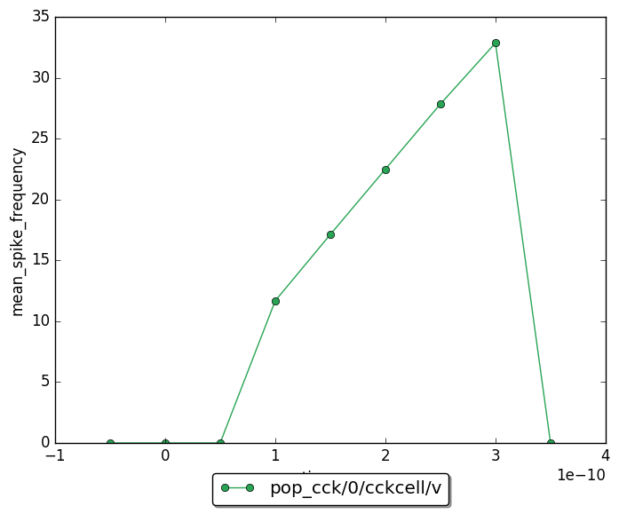</a>
  </td>
  <td><a href="firing_rates_cck.png">
    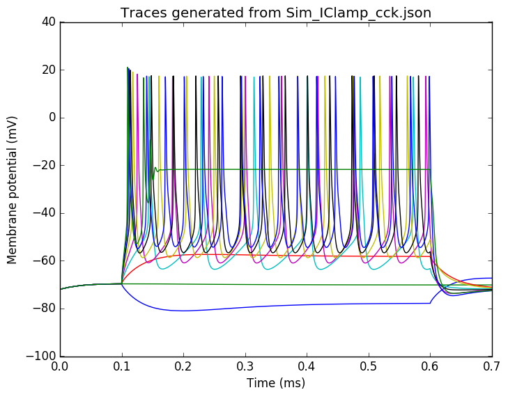</a>
  </td>
  <td><a href="heatmap_cck.png">
    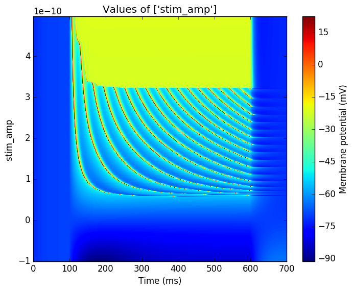</a>
  </td>
<tr>
<tr>
  <td><b>axoaxonic</b></td>
  <td><a href="mean_spike_frequency_axoaxonic.png">
    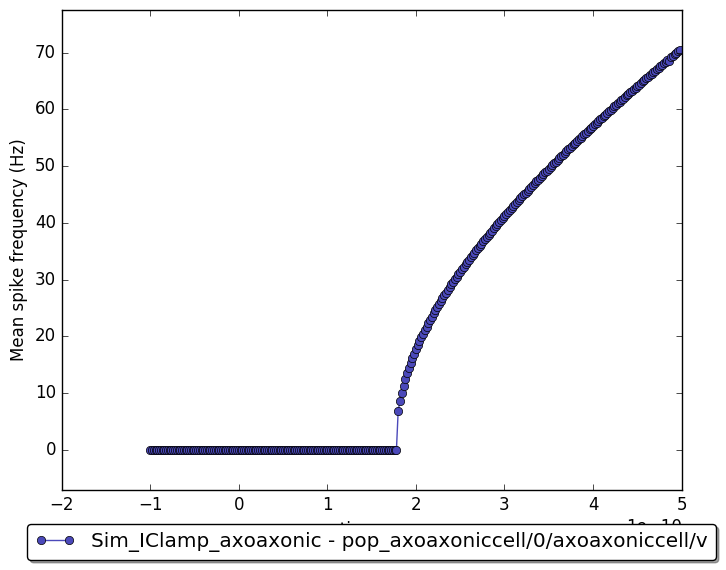</a>
  </td>
  <td><a href="firing_rates_axoaxonic.png">
    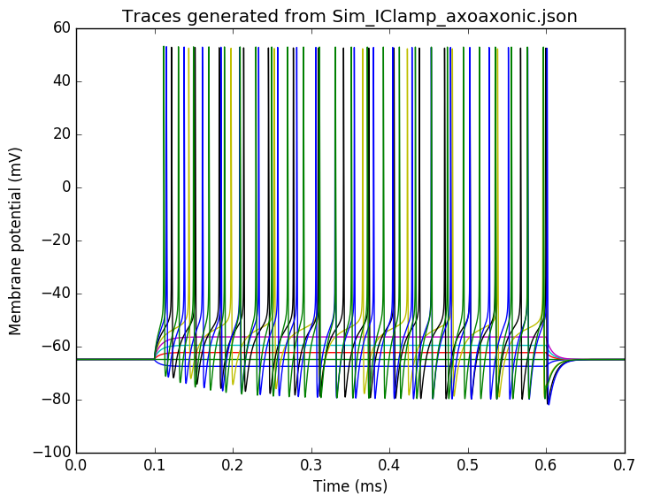</a>
  </td>
  <td><a href="heatmap_axoaxonic.png">
    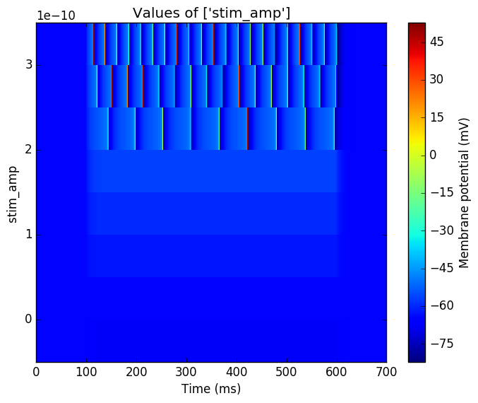</a>
  </td>
<tr>
<tr>
  <td><b>poolosyn</b></td>
  <td><a href="mean_spike_frequency_poolosyn.png">
    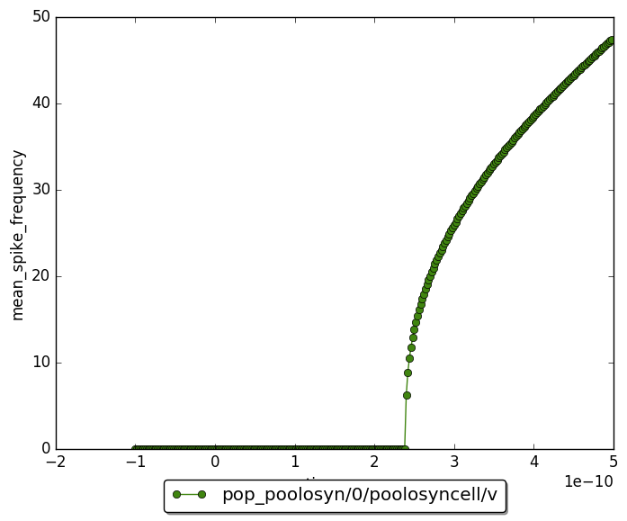</a>
  </td>
  <td><a href="firing_rates_poolosyn.png">
    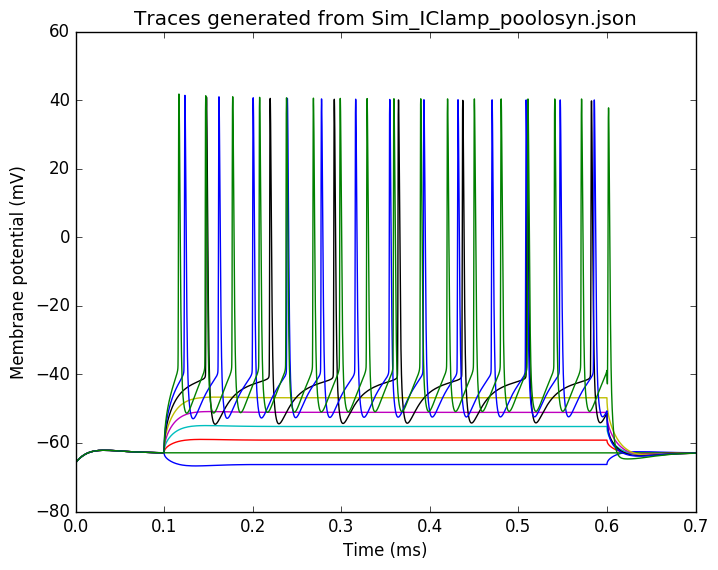</a>
  </td>
  <td><a href="heatmap_poolosyn.png">
    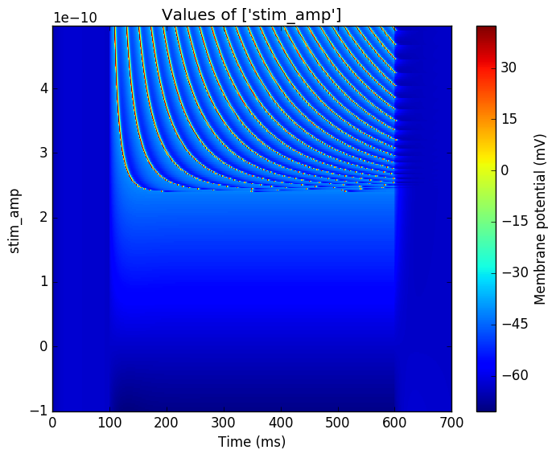</a>
  </td>
<tr>
