### CA1 cell summary 
<table>
<tr>
  <td width=30><b>sca</b></td>
  <td><a href="images/mean_spike_frequency_sca.png">
    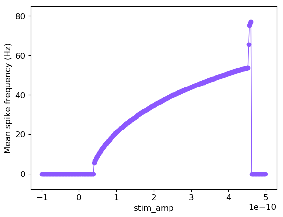</a>
  </td>
  <td><a href="images/firing_rates_sca.png">
    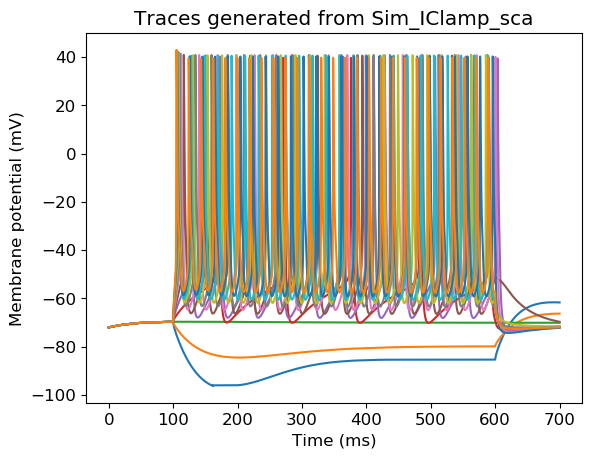</a>
  </td>
  <td><a href="images/heatmap_sca.png">
    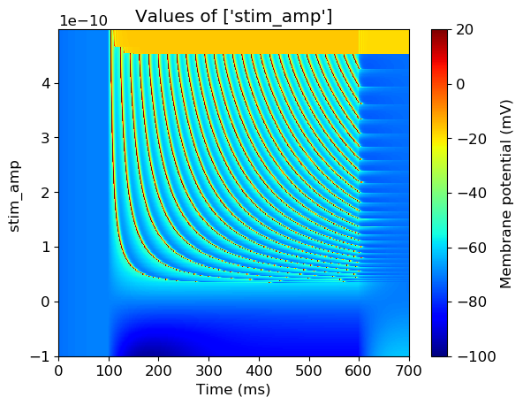</a>
  </td>
  <td><a href="images/dt_traces_sca.png">
    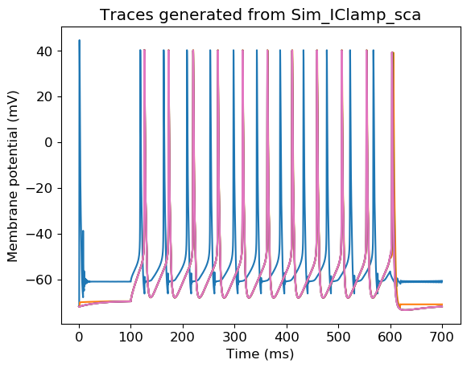</a>
  </td>
  <td><a href="images/heatmap_dt_sca.png">
    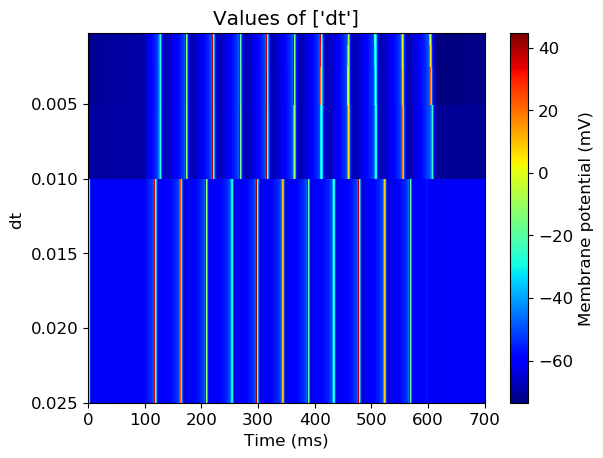</a>
  </td>
  <td><a href="images/mean_spike_frequency_dt_sca.png">
    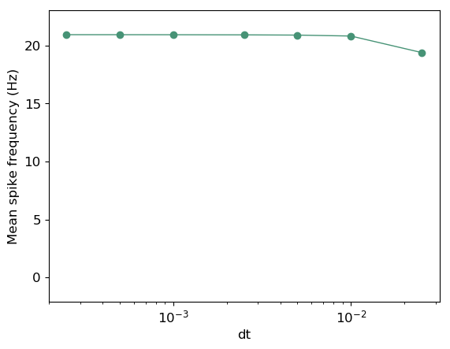</a>
  </td>
<tr>
<tr>
  <td width=30><b>olm</b></td>
  <td><a href="images/mean_spike_frequency_olm.png">
    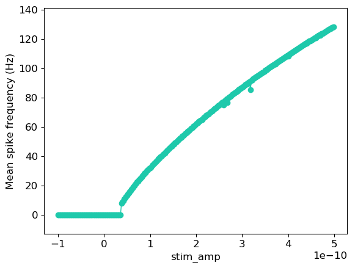</a>
  </td>
  <td><a href="images/firing_rates_olm.png">
    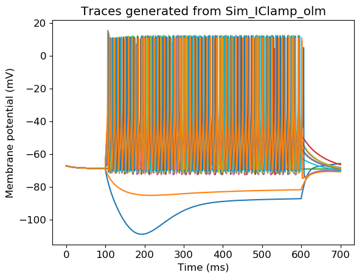</a>
  </td>
  <td><a href="images/heatmap_olm.png">
    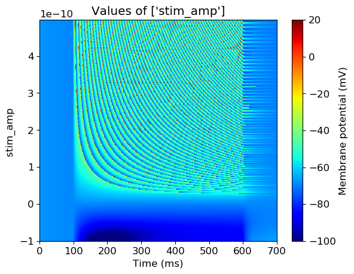</a>
  </td>
  <td><a href="images/dt_traces_olm.png">
    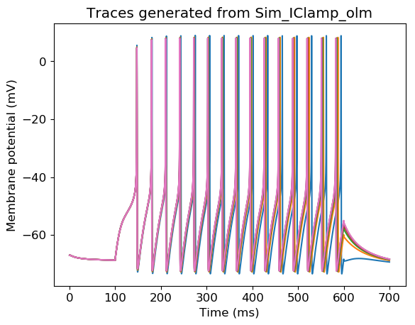</a>
  </td>
  <td><a href="images/heatmap_dt_olm.png">
    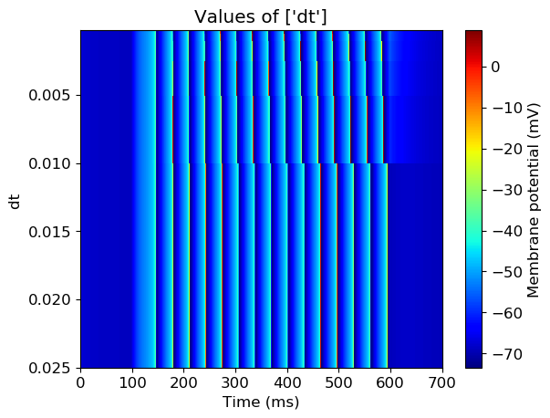</a>
  </td>
  <td><a href="images/mean_spike_frequency_dt_olm.png">
    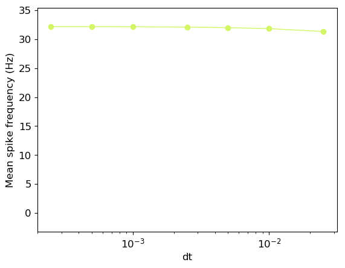</a>
  </td>
<tr>
<tr>
  <td width=30><b>pvbasket</b></td>
  <td><a href="images/mean_spike_frequency_pvbasket.png">
    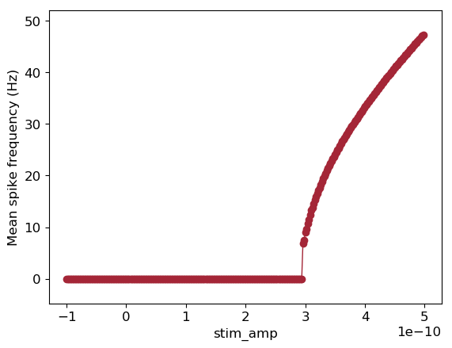</a>
  </td>
  <td><a href="images/firing_rates_pvbasket.png">
    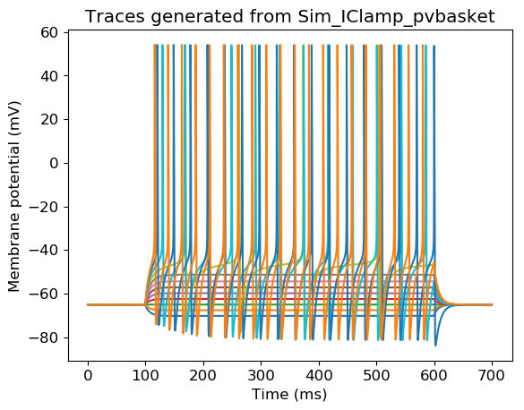</a>
  </td>
  <td><a href="images/heatmap_pvbasket.png">
    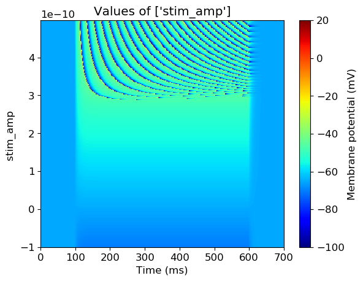</a>
  </td>
  <td><a href="images/dt_traces_pvbasket.png">
    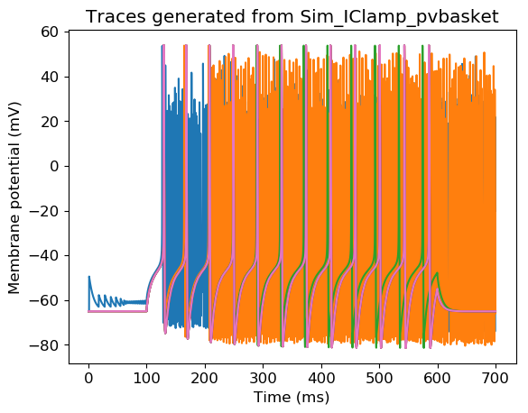</a>
  </td>
  <td><a href="images/heatmap_dt_pvbasket.png">
    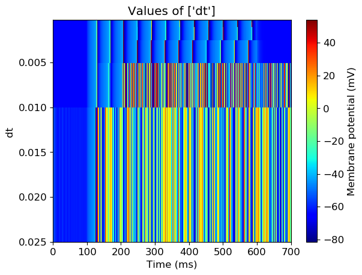</a>
  </td>
  <td><a href="images/mean_spike_frequency_dt_pvbasket.png">
    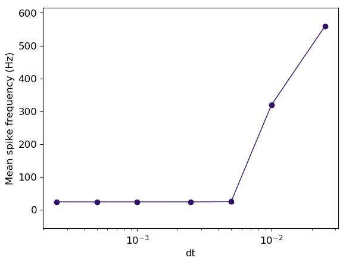</a>
  </td>
<tr>
<tr>
  <td width=30><b>ivy</b></td>
  <td><a href="images/mean_spike_frequency_ivy.png">
    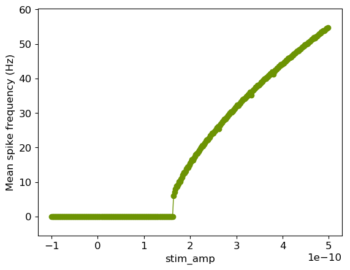</a>
  </td>
  <td><a href="images/firing_rates_ivy.png">
    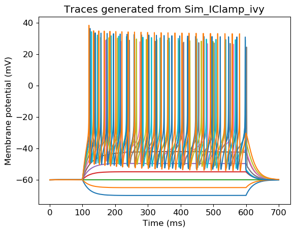</a>
  </td>
  <td>
  </td>
  <td><a href="images/dt_traces_ivy.png">
    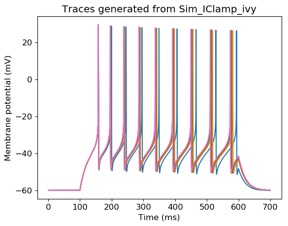</a>
  </td>
  <td>
  </td>
  <td><a href="images/mean_spike_frequency_dt_ivy.png">
    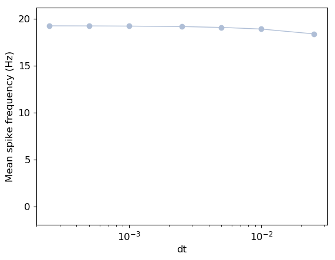</a>
  </td>
<tr>
<tr>
  <td width=30><b>ngf</b></td>
  <td><a href="images/mean_spike_frequency_ngf.png">
    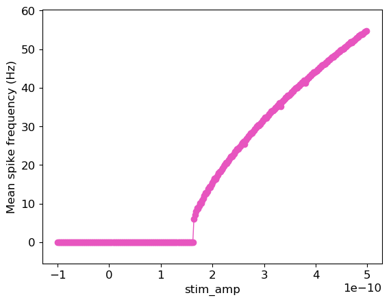</a>
  </td>
  <td>
  </td>
  <td>
  </td>
  <td><a href="images/dt_traces_ngf.png">
    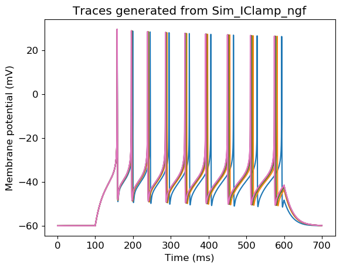</a>
  </td>
  <td>
  </td>
  <td><a href="images/mean_spike_frequency_dt_ngf.png">
    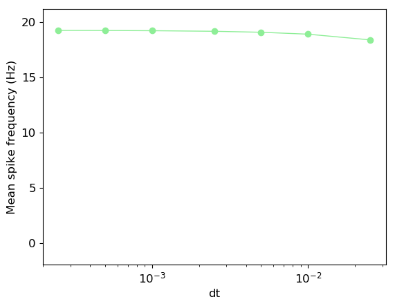</a>
  </td>
<tr>
<tr>
  <td width=30><b>bistratified</b></td>
  <td><a href="images/mean_spike_frequency_bistratified.png">
    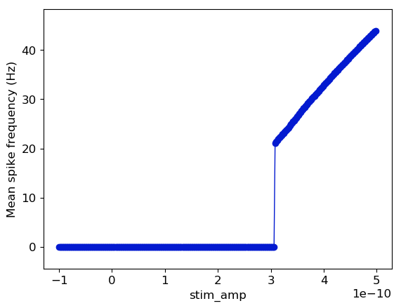</a>
  </td>
  <td><a href="images/firing_rates_bistratified.png">
    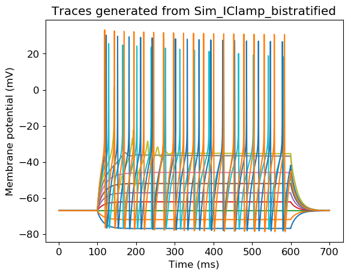</a>
  </td>
  <td><a href="images/heatmap_bistratified.png">
    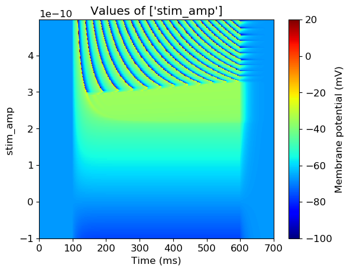</a>
  </td>
  <td><a href="images/dt_traces_bistratified.png">
    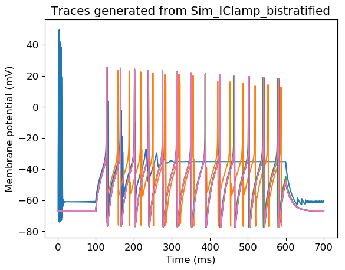</a>
  </td>
  <td><a href="images/heatmap_dt_bistratified.png">
    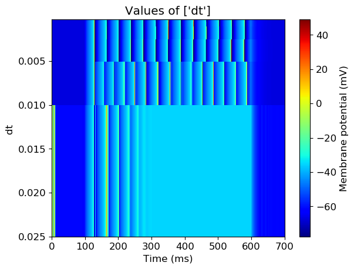</a>
  </td>
  <td><a href="images/mean_spike_frequency_dt_bistratified.png">
    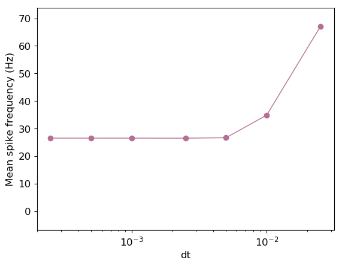</a>
  </td>
<tr>
<tr>
  <td width=30><b>cck</b></td>
  <td><a href="images/mean_spike_frequency_cck.png">
    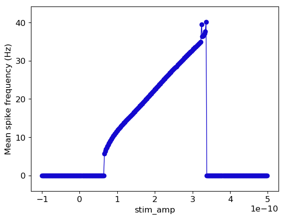</a>
  </td>
  <td><a href="images/firing_rates_cck.png">
    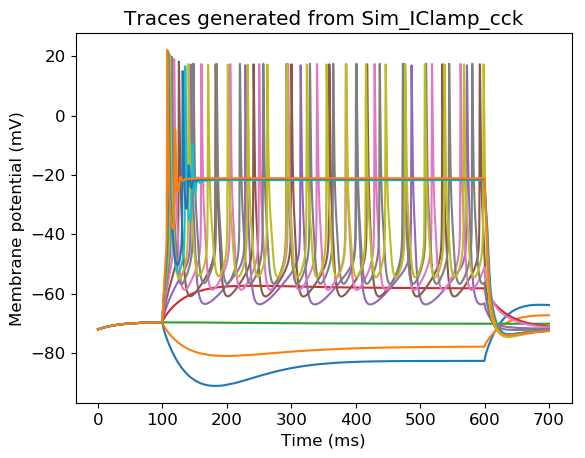</a>
  </td>
  <td><a href="images/heatmap_cck.png">
    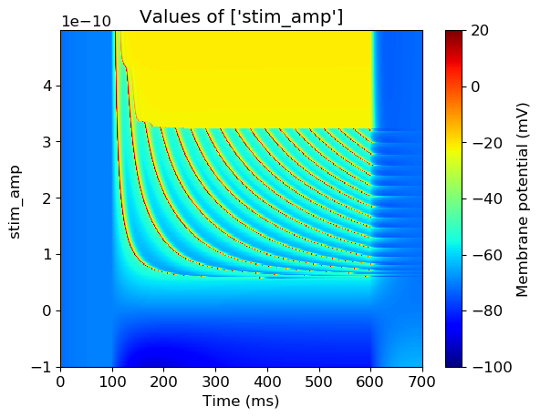</a>
  </td>
  <td><a href="images/dt_traces_cck.png">
    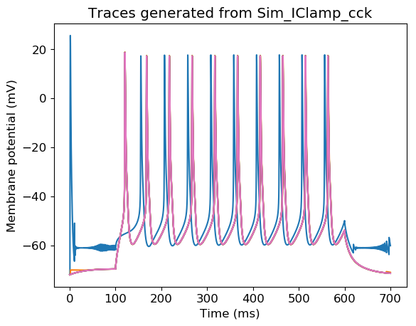</a>
  </td>
  <td><a href="images/heatmap_dt_cck.png">
    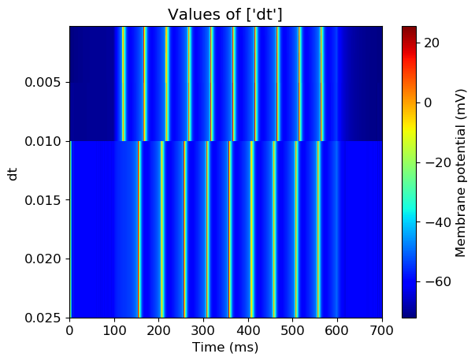</a>
  </td>
  <td><a href="images/mean_spike_frequency_dt_cck.png">
    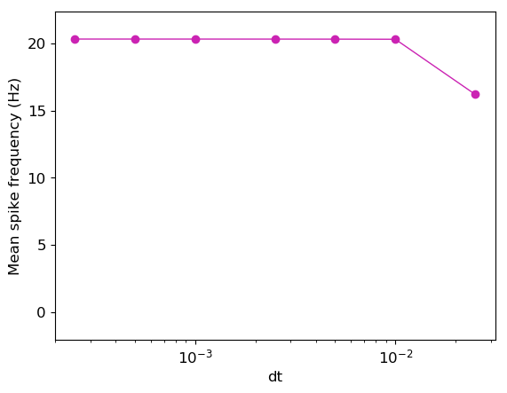</a>
  </td>
<tr>
<tr>
  <td width=30><b>axoaxonic</b></td>
  <td><a href="images/mean_spike_frequency_axoaxonic.png">
    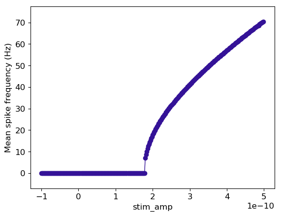</a>
  </td>
  <td><a href="images/firing_rates_axoaxonic.png">
    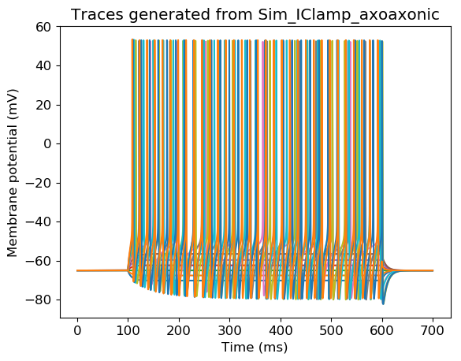</a>
  </td>
  <td><a href="images/heatmap_axoaxonic.png">
    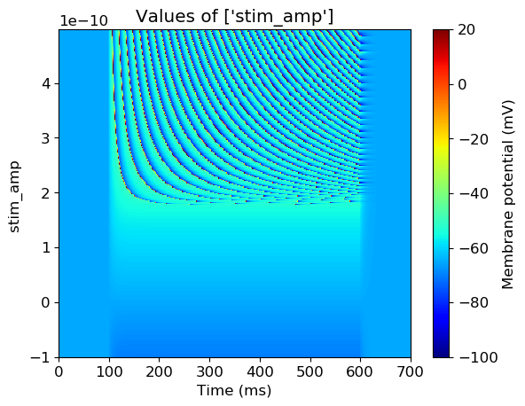</a>
  </td>
  <td><a href="images/dt_traces_axoaxonic.png">
    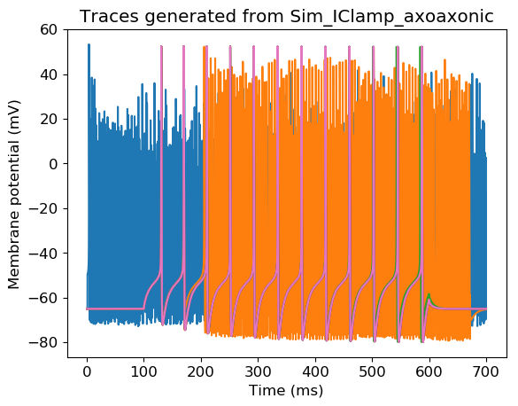</a>
  </td>
  <td><a href="images/heatmap_dt_axoaxonic.png">
    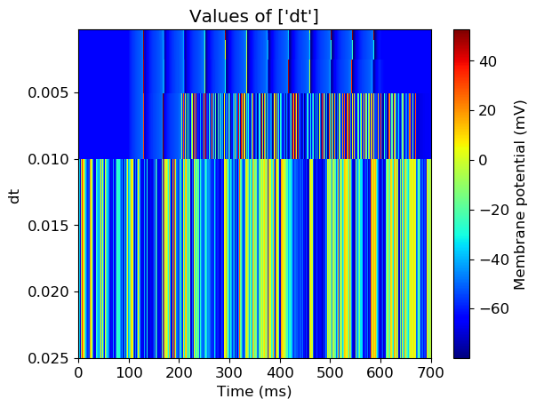</a>
  </td>
  <td><a href="images/mean_spike_frequency_dt_axoaxonic.png">
    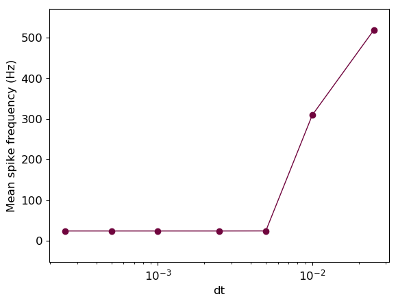</a>
  </td>
<tr>
<tr>
  <td width=30><b>poolosyn</b></td>
  <td>
  </td>
  <td>
  </td>
  <td><a href="images/heatmap_poolosyn.png">
    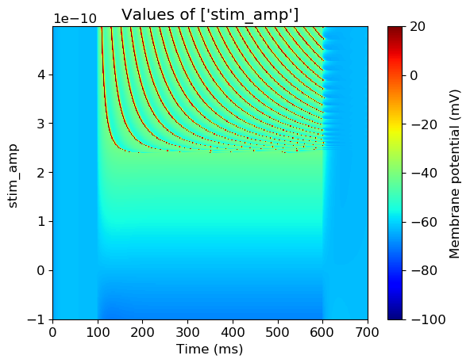</a>
  </td>
  <td><a href="images/dt_traces_poolosyn.png">
    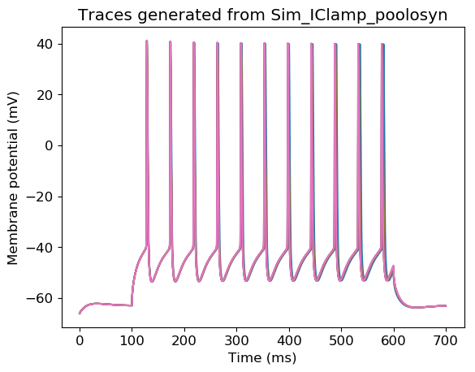</a>
  </td>
  <td><a href="images/heatmap_dt_poolosyn.png">
    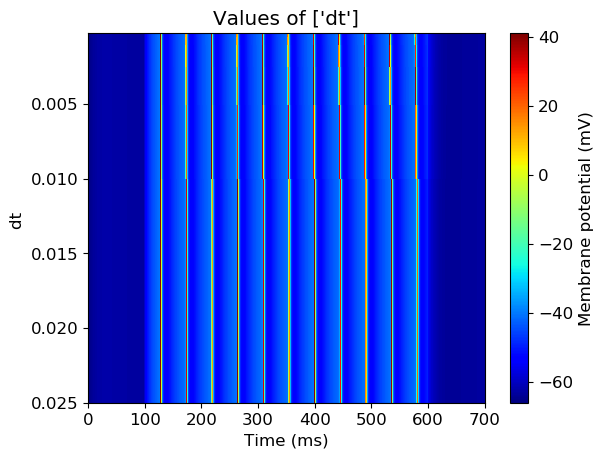</a>
  </td>
  <td><a href="images/mean_spike_frequency_dt_poolosyn.png">
    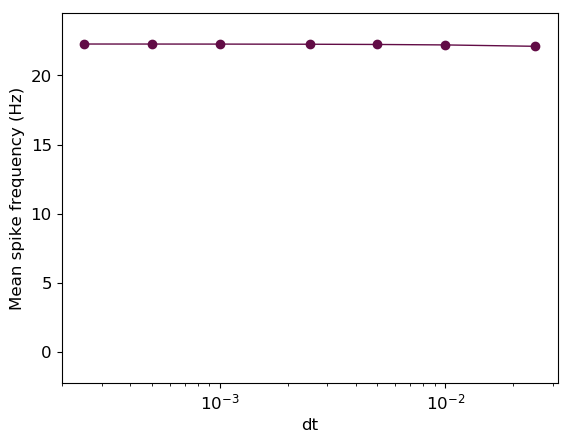</a>
  </td>
<tr>
